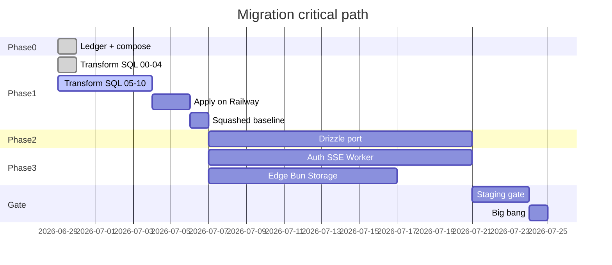

# Migration delivery board

Master checklist for the Supabase → Railway Postgres big-bang. **Update this file when migration tasks complete** (status, snapshot metrics, dispatch log).

**Plan:** [`supabase-postgres-migration-plan.md`](./supabase-postgres-migration-plan.md)  
**Orchestration:** [`migration-orchestration.md`](./migration-orchestration.md)  
**Branch:** `feat/supabase-postgres-migration`  
**Railway:** [`visual-asset-review`](./railway-review-env.md) — [dashboard](https://railway.com/project/32b36c6c-5f3d-463b-8c7f-bbcd70351e8f?environmentId=18ef9173-4b33-4a62-9b94-9dfc7a36eb05)  
**Last updated:** 2026-06-29

### Snapshot (rolling)

| Metric | Value | Gate |
|--------|------:|------|
| Migration ledger (Railway PG 18) | 34/34 | G0 ✓ |
| `app/lib/database/*.server.ts` on tenant-db | **7 / 13** | G2 |
| App `supabase.from()` call sites in `app/` | **~30+** (queue/survey paths; platform-data down ~16) | G2 |
| `database.types` imports in `app/` | **~168 files** | G2 (delete at exit) |
| Dropped subtype tables in app runtime | **0** `.from(live\|ivr\|message_campaign)` | G1 ✓ |
| E2E on review URL | Not run | G4 |

---

## Gate criteria (do not skip)

| Gate | Requirement |
|------|-------------|
| **G0** | Ledger audit doc + `npm run db:ledger:check` |
| **G1** | Schema transform on Railway review + squashed `drizzle/0000_baseline.sql` |
| **G2** | Zero `supabase.from()` in `app/`; `database.types.ts` deleted |
| **G3** | Full v2 stack on Railway review (3A–3F) |
| **G4** | 77/77 E2E + manual Twilio smoke on review URL |
| **G5** | Storage copy verified; worker replaces all pg_cron |
| **G6** | Prod maintenance window + env flip + smoke |

---

## Phase 0 — Audit & local stack

| ID | Task | Status | Owner |
|----|------|--------|-------|
| 0.1 | Migration ledger audit doc | Done | Orchestrator |
| 0.2 | `npm run db:ledger:check` script | Done | Orchestrator |
| 0.3 | `docker-compose.dev.yml` (Postgres + MinIO + Inbucket) | Done | Orchestrator |
| 0.4 | Plan copied to `docs/supabase-postgres-migration-plan.md` | Done | Orchestrator |
| 0.5 | Ledger compare on Railway review DB | Done | 34/34 match (2026-06-29) |
| 0.6 | `feat/supabase-postgres-migration` branch | Done | Orchestrator |

---

## Phase 1 — Railway schema transform (WS-A)

| ID | Task | Status | Owner |
|----|------|--------|-------|
| 1.1 | `00-preflight.sql` | Done | WS-A |
| 1.2 | `01-drop-vestigial.sql` | Done | WS-A |
| 1.3 | `02-consolidate-campaign.sql` (sketch) | Done — needs backfill review | WS-A |
| 1.4 | `03-normalize-campaign-queue.sql` | Done — RPC rewrite needed before apply | WS-A |
| 1.5 | `04-contact-prune.sql` | Done | WS-A |
| 1.6 | `05-drop-rcs-onboarding.sql` | Done | WS-A |
| 1.7 | `06-adr-0015-call-message.sql` | Done — sketch | WS-A |
| 1.8 | `07-split-workspace-twilio-data.sql` | Done — sketch | WS-A |
| 1.9 | `08-household-key.sql` | Done | WS-E |
| 1.10 | `09-drop-legacy-presence.sql` | Done — guarded | WS-A + WS-C |
| 1.11 | `10-verify.sql` | Done | WS-A |
| 1.12 | Apply transform on Railway review | **Mostly done** | 01–05, 08, 08b, 10 applied; **06, 07, 09** pending (SSE/worker) |
| 1.13 | `pg_dump --schema-only` → `drizzle/0000_baseline.sql` | Done | 6951 lines via `dump-baseline.sh` |
| 1.14 | Regenerate `app/db/schema.ts` (introspect) | **Blocked** | drizzle-kit introspect JSON error on PG 18 — hand-synced from baseline |
| 1.15 | Archive `supabase/migrations/` | Done | 34 files in `docs/archive/supabase-migrations/` |
| 1.16 | Update `workspace-scoped-tables.ts` for new shape | Done | 22 scoped tables; vestigial + subtype tables removed |
| 1.17 | App unified `campaign` runtime | **Done** | IVR Remix routes, export, create/settings flows; no subtype table writes |
| 1.18 | `campaign-ivr.server.ts` + queue_state UI/stats | **Done** | Shared script helpers; `applyQueueStatusFilter` replaces dropped `status` column |

### Phase 1D — Scriptkit (WS-D, parallel)

| ID | Task | Status | Owner |
|----|------|--------|-------|
| 1D.1 | Publish `scriptkit-call-script-*` from GitHub Packages | Todo | CHS monorepo |
| 1D.2 | Create `scriptkit-survey-core` + `scriptkit-survey-react` | Todo | CHS monorepo |
| 1D.3 | Wire Callcaster survey routes to packages | Todo | WS-D |
| 1D.4 | Remove `vendor/scriptkit/` | Todo | WS-D |

---

## Phase 2 — Drizzle port (WS-B)

Inventory: [`phase-2-drizzle-port-inventory.md`](./phase-2-drizzle-port-inventory.md)

| ID | Module | Status | Owner |
|----|--------|--------|-------|
| 2.1 | `workspace.server.ts` | **Done** | Supabase retained for auth + RPCs only |
| 2.2 | `campaign.server.ts` + `campaign-stats.server.ts` | **Done** | Tenant-db for campaign/message/script/outreach; Supabase for RPC + `campaign_queue` |
| 2.3 | Queue/dial stack | **Done** | `telephony-db.server.ts`; auto-dial/dial/status/end/$roomId + `twilio-call-status`; 88 dial-stack tests green |
| 2.4 | Contacts + audiences | **Done** | `contact.server.ts`, `contact-audience.server.ts` |
| 2.5 | Messaging + chats | **Done** | sms-send, inbound-sms, auto-dial/dial credits+calls on tenant-db/telephony-db; Supabase kept for RPCs + realtime only |
| 2.6 | Billing + ledger + RPC wrappers | **Partial** | `stripe.server.ts` done; `transaction-history`, reconciliation remain |
| 2.7 | Telephony adjunct | Todo | `agent-status`, handset, inbound queue |
| 2.8 | Twilio config modules | Todo | 4× `workspace-twilio-*.server.ts` |
| 2.9 | Platform facades | **In progress** | contacts/audiences/scripts/status/upload on tenant-db; queue + survey APIs remain PostgREST |
| 2.10 | Route stragglers | **Done** | Last `supabase.from()` removed; `QueueContent` contact fetch via `/api/contacts/:id` |
| 2.11 | UI/hooks type cleanup | Todo | `LiveCampaign` / `IVRCampaign` / `MessageCampaign` in components |
| 2.12 | Delete `database.types.ts` | Todo | ~168 imports remain |
| 2.13 | E2E factories → Drizzle | Todo | `e2e/fixtures/factories.ts` still references subtype tables |

**Progress:** **7 done** · **2 in progress** · 4 todo (of 13 modules) · ~168 `database.types` imports · **127** dial/messaging unit tests green

---

## Phase 3 — Staging stack (WS-C)

Gap analysis: [`phase-3-stack-gap-analysis.md`](./phase-3-stack-gap-analysis.md)

| ID | Track | Status | Owner |
|----|-------|--------|-------|
| 3A.1 | Add CHS auth packages | Todo | WS-C |
| 3A.2 | `auth-schema.ts` + `auth-instance.ts` | Todo | WS-C |
| 3A.3 | User import (bcrypt) | Todo | WS-C |
| 3A.4 | Replace `verifyAuth` across routes | Todo | WS-C |
| 3A.5 | 2FA for owner/admin/field_director | Todo | WS-C |
| 3B.1 | `workspace_events` + activity log schema | Todo | WS-C |
| 3B.2 | SSE route + pg-realtime package | Todo | WS-C |
| 3B.3 | Replace Realtime hooks | Todo | WS-C |
| 3C.1 | `job` table schema | Todo | WS-C |
| 3C.2 | Bun worker service | Todo | WS-C |
| 3C.3 | Port twilio_open_sync handler | Todo | WS-C |
| 3C.4 | Port number_rental_billing handler | Todo | WS-C |
| 3C.5 | Port billing_reconcile handler | Todo | WS-C |
| 3C.6 | Port queue-next, audience-upload, active_change | Todo | WS-C |
| 3D.1 | Port sms-status (canonical) | **Partial** | Remix `/api/sms/status` live; Edge `sms-status` not deleted |
| 3D.2 | Port ivr-flow, ivr-status, ivr-recording | **In progress** | Edge selects unified `campaign(*, script:script(*))`; `_shared/unified-campaign-script.ts` |
| 3D.3 | Port acd-router | Todo | WS-C |
| 3D.4 | Repoint Twilio webhook URLs | Todo | WS-C |
| 3D.5 | Deno tests → Vitest | Todo | WS-C |
| 3E.1 | S3/storage adapter | Todo | WS-C |
| 3E.2 | Bulk Supabase → Railway Buckets copy | Todo | Infra |
| 3E.3 | Wire MinIO local dev | Todo | WS-C |
| 3F.1 | Bun start script + Dockerfile | Todo | WS-C |
| 3F.2 | Remove Express + buffer-polyfill | Todo | WS-C |

---

## Phase 4 — Staging gate

| ID | Check | Status |
|----|-------|--------|
| 4.1 | `npm run typecheck && lint && test` | Todo |
| 4.2 | `npm run test:e2e` 77/77 on review URL | Todo |
| 4.3 | Scriptkit call + survey paths | Todo |
| 4.4 | Manual Twilio smoke checklist (plan) | Todo |
| 4.5 | `tools:api:surface:check` green | Todo |

---

## Phase 5 — Prod big-bang

| ID | Step | Status |
|----|------|--------|
| 5.1 | Announce maintenance window | Todo |
| 5.2 | App read-only / offline | Todo |
| 5.3 | Final pg_dump delta → prod Postgres | Todo |
| 5.4 | Flip all env vars (single deploy) | Todo |
| 5.5 | Drop Supabase client deps | Todo |
| 5.6 | Smoke + reopen | Todo |
| 5.7 | Decommission hosted Supabase (24h archive) | Todo |

---

## Phase 6 — Cleanup

| ID | Task | Status |
|----|------|--------|
| 6.1 | Revise ADR-0008 | Todo |
| 6.2 | Update CONTEXT.md | Todo |
| 6.3 | Update AGENTS.md + build-against-docs-plan | Todo |
| 6.4 | Close GitHub #1013 | Todo |
| 6.5 | Remove Deno from CI gate | Todo |

---

## Active workstreams (parallel)

## Next 5 actions (orchestrator)

1. **WS-B 2.9** — Continue `platform-data.server.ts` list/detail APIs on tenant-db + Drizzle
2. **WS-B 2.6–2.8** — Billing reconciliation + Twilio config modules
3. **WS-C 3D** — Delete Edge `sms-status`; finish Edge IVR handler tests + webhook repoint
4. **WS-B 2.11–2.12** — UI type cleanup + drop `database.types.ts`
5. **WS-A 1.12** — Apply transform **06, 07, 09** when SSE/worker schema lands

---

## Agent dispatch log

| Date | Agent | Deliverable |
|------|-------|-------------|
| 2026-06-29 | explore | [`phase-2-drizzle-port-inventory.md`](./phase-2-drizzle-port-inventory.md) |
| 2026-06-29 | explore | [`phase-3-stack-gap-analysis.md`](./phase-3-stack-gap-analysis.md) |
| 2026-06-29 | generalPurpose | `scripts/schema-transform/00`–`04` SQL |
| 2026-06-29 | orchestrator | SQL `05`–`10`, delivery board, branch, inventories |
| 2026-06-29 | agent | Unified campaign: IVR Remix routes, export, create flow, `campaign-ivr.server.ts` |
| 2026-06-29 | agent | Phase 2 B1: `campaign-stats.server.ts` → tenant-db |
| 2026-06-29 | agent | Phase 2 B2 (partial): `call-screen`, `auto-dial`, settings readiness fix |
| 2026-06-29 | agent | Sprint 2: `telephony-db.server.ts`, dial/auto-dial stack tenant-db, 88 tests; Edge IVR unified script; `workspace-conversations` tenant-db |
| 2026-06-29 | agent | Messaging port: `workspace-credits`, `sms-send`/inbound-sms/ivr/auto-dial tenant-db; test stubs; **127** dial+messaging tests green; route `supabase.from()` → 1 file |
| 2026-06-29 | agent | Platform-data: contacts, audiences, scripts, campaign status, audience upload on tenant-db/Drizzle; `buildContactSearchWhere` |
