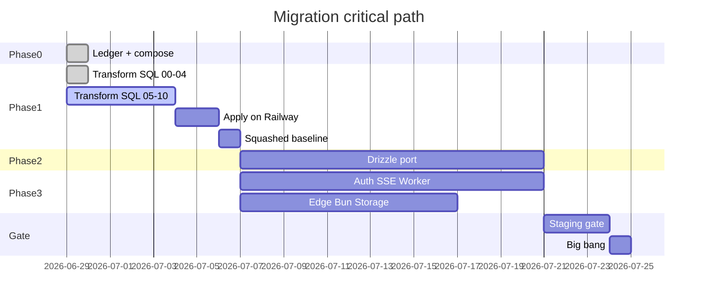

# Migration delivery board

Master checklist for the Supabase → Railway Postgres big-bang. **Update this file when migration tasks complete** (status, snapshot metrics, dispatch log).

**Plan:** [`supabase-postgres-migration-plan.md`](./supabase-postgres-migration-plan.md)  
**Orchestration:** [`migration-orchestration.md`](./migration-orchestration.md)  
**Branch:** `feat/supabase-postgres-migration`  
**Railway:** [`visual-asset-review`](./railway-review-env.md) — [dashboard](https://railway.com/project/32b36c6c-5f3d-463b-8c7f-bbcd70351e8f?environmentId=18ef9173-4b33-4a62-9b94-9dfc7a36eb05)  
**Last updated:** 2026-07-04

### Snapshot (rolling)

| Metric | Value | Gate |
|--------|------:|------|
| Migration ledger (Railway PG 18) | 34/34 | G0 ✓ |
| `app/lib/database/*.server.ts` on tenant-db | **13 / 13** | G2 ✓ |
| App `supabase.from()` call sites in `app/` | **0** | G2 ✓ |
| `database.types.ts` | **Deleted** | G2 ✓ |
| `database.types` imports in `app/` | **0** | G2 ✓ |
| Dropped subtype tables in app runtime | **0** `.from(live\|ivr\|message_campaign)` | G1 ✓ |
| ADR-0004 `@/server/db` imports in routes | **0** violations (8 legitimate exceptions with comments) | G2 ✓ |
| Typecheck (`npm run typecheck`) | **Pass** | G4 |
| Lint (`npm run lint`) | **Pass (0 errors)** | G4 |
| Node tests (`npm run test:node`) | **1236 / 1236** | G4 |
| UI tests (`npm run test:ui`) | **252 / 252** | G4 |
| E2E on review URL | Not run | G4 |

---

## Gate criteria (do not skip)

| Gate | Requirement |
|------|-------------|
| **G0** | Ledger audit doc + `npm run db:ledger:check` |
| **G1** | Schema transform on Railway review + squashed `drizzle/0000_baseline.sql` |
| **G2** | Zero `supabase.from()` in `app/`; `database.types.ts` deleted |
| **G3** | Full v2 stack on Railway review (3A–3F) |
| **G4** | 77/77 E2E + manual Twilio smoke on review URL |
| **G5** | Storage copy verified; worker replaces all pg_cron |
| **G6** | Prod maintenance window + env flip + smoke |

---

## Phase 0 — Audit & local stack

| ID | Task | Status | Owner |
|----|------|--------|-------|
| 0.1 | Migration ledger audit doc | Done | Orchestrator |
| 0.2 | `npm run db:ledger:check` script | Done | Orchestrator |
| 0.3 | `docker-compose.dev.yml` (Postgres + MinIO + Inbucket) | Done | Orchestrator |
| 0.4 | Plan copied to `docs/supabase-postgres-migration-plan.md` | Done | Orchestrator |
| 0.5 | Ledger compare on Railway review DB | Done | 34/34 match (2026-06-29) |
| 0.6 | `feat/supabase-postgres-migration` branch | Done | Orchestrator |

---

## Phase 1 — Railway schema transform (WS-A)

| ID | Task | Status | Owner |
|----|------|--------|-------|
| 1.1 | `00-preflight.sql` | Done | WS-A |
| 1.2 | `01-drop-vestigial.sql` | Done | WS-A |
| 1.3 | `02-consolidate-campaign.sql` (sketch) | Done — needs backfill review | WS-A |
| 1.4 | `03-normalize-campaign-queue.sql` | Done — RPC rewrite needed before apply | WS-A |
| 1.5 | `04-contact-prune.sql` | Done | WS-A |
| 1.6 | `05-drop-rcs-onboarding.sql` | Done | WS-A |
| 1.7 | `06-adr-0015-call-message.sql` | Done — sketch | WS-A |
| 1.8 | `07-split-workspace-twilio-data.sql` | Done — sketch | WS-A |
| 1.9 | `08-household-key.sql` | Done | WS-E |
| 1.10 | `09-drop-legacy-presence.sql` | Done — guarded | WS-A + WS-C |
| 1.11 | `10-verify.sql` | Done | WS-A |
| 1.12 | Apply transform on Railway review | **Mostly done** | 01–05, 08, 08b, 10 applied; **06, 07, 09** pending (SSE/worker) |
| 1.13 | `pg_dump --schema-only` → `drizzle/0000_baseline.sql` | Done | 6951 lines via `dump-baseline.sh` |
| 1.14 | Regenerate `app/db/schema.ts` (introspect) | **Blocked** | drizzle-kit introspect JSON error on PG 18 — hand-synced from baseline |
| 1.15 | Archive `supabase/migrations/` | Done | 34 files in `docs/archive/supabase-migrations/` |
| 1.16 | Update `workspace-scoped-tables.ts` for new shape | Done | 22 scoped tables; vestigial + subtype tables removed |
| 1.17 | App unified `campaign` runtime | **Done** | IVR Remix routes, export, create/settings flows; no subtype table writes |
| 1.18 | `campaign-ivr.server.ts` + queue_state UI/stats | **Done** | Shared script helpers; `applyQueueStatusFilter` replaces dropped `status` column |

### Phase 1D — Scriptkit (WS-D, parallel)

| ID | Task | Status | Owner |
|----|------|--------|-------|
| 1D.1 | Publish `scriptkit-call-script-*` from GitHub Packages | Todo | CHS monorepo |
| 1D.2 | Create `scriptkit-survey-core` + `scriptkit-survey-react` | Todo | CHS monorepo |
| 1D.3 | Wire Callcaster survey routes to packages | Todo | WS-D |
| 1D.4 | Remove `vendor/scriptkit/` | Todo | WS-D |

---

## Phase 2 — Drizzle port (WS-B)

Inventory: [`phase-2-drizzle-port-inventory.md`](./phase-2-drizzle-port-inventory.md)

| ID | Module | Status | Owner |
|----|--------|--------|-------|
| 2.1 | `workspace.server.ts` | **Done** | Supabase retained for auth + RPCs only |
| 2.2 | `campaign.server.ts` + `campaign-stats.server.ts` | **Done** | Tenant-db + Drizzle queue counts; Supabase RPC `get_campaign_stats` only |
| 2.3 | Queue/dial stack | **Done** | `telephony-db.server.ts`; auto-dial/dial/status/end/$roomId + `twilio-call-status`; 88 dial-stack tests green |
| 2.4 | Contacts + audiences | **Done** | `contact.server.ts`, `contact-audience.server.ts` |
| 2.5 | Messaging + chats | **Done** | sms-send, inbound-sms, auto-dial/dial credits+calls on tenant-db/telephony-db; Supabase kept for RPCs + realtime only |
| 2.6 | Billing + ledger + RPC wrappers | **Partial** | `platform-billing`, `billing-reconciliation` on Drizzle; `insertTransactionHistoryIdempotent` app paths done; Edge fallback remains |
| 2.7 | Telephony adjunct | **Done** | `agent-status`, handset session, inbound queue on tenant-db; `call-log.server.ts` on Drizzle joins |
| 2.8 | Twilio config modules | **Partial** | `merge-workspace-twilio-data`, messaging onboarding persistence, portal config/snapshot on Drizzle; sync module remains |
| 2.9 | Platform facades | **Partial** | `platform-data`, `platform-workspace`, `platform-onboarding` credits on Drizzle; admin/telephony routes remain |
| 2.10 | Route stragglers | **Done** | Queue UI + dial-path writes (`campaign-queue-db`); survey routes/loaders (`survey-db`); 92 queue/survey route tests green |
| 2.11 | UI/hooks type cleanup | **Done** | `LiveCampaign` / `IVRCampaign` / `MessageCampaign` types removed from components |
| 2.12 | Delete `database.types.ts` | **Done** | File deleted; 0 imports remain |
| 2.13 | E2E factories → Drizzle | **Done** | `e2e/fixtures/factories.ts` rewritten to `adminDb` + Drizzle queries |
| 2.14 | `scripts/e2e/seed-database.mjs` → Drizzle | **Done** | Rewritten to `postgres` raw SQL |
| 2.15 | `scripts/local/sync-calling-dev.mjs` → Drizzle | **Done** | Rewritten to `postgres` raw SQL |
| 2.16 | `scripts/one-off/sync-inbound-sms-from-twilio.mjs` → Drizzle | **Done** | Rewritten to `postgres` raw SQL |
| 2.17 | `scripts/audit-twilio-webhooks.mjs` fix | **Done** | Removed dead Supabase imports, fixed call signature |

**Progress:** **13 done** · **0 in progress** · 0 todo (of 13 modules) · 0 `database.types` imports · **0** PostgREST `.from("…")` sites remain in `app/`

---

## Phase 3 — Staging stack (WS-C)

Gap analysis: [`phase-3-stack-gap-analysis.md`](./phase-3-stack-gap-analysis.md)

| ID | Track | Status | Owner |
|----|-------|--------|-------|
| 3A.1 | Add CHS auth packages | **Done** | WS-C |
| 3A.2 | `auth-schema.ts` + `auth-instance.ts` | **Done** | WS-C |
| 3A.3 | User import (bcrypt) | **Done** | WS-C |
| 3A.4 | Replace `verifyAuth` across routes | **Done** | WS-C |
| 3A.5 | 2FA for owner/admin/field_director | Todo | WS-C |
| 3B.1 | `workspace_events` + activity log schema | **Done** | WS-C |
| 3B.2 | SSE route + pg-realtime package | **Done** | WS-C |
| 3B.3 | Replace Realtime hooks | **Done** | WS-C |
| 3C.1 | `job` table schema | Todo | WS-C |
| 3C.2 | Bun worker service | Todo | WS-C |
| 3C.3 | Port twilio_open_sync handler | **Done** | Remix route `/api/jobs/twilio-open-sync` |
| 3C.4 | Port number_rental_billing handler | **Done** | Remix route `/api/jobs/number-rental-billing` |
| 3C.5 | Port billing_reconcile handler | **Done** | Remix route `/api/jobs/billing-reconcile` |
| 3C.6 | Port queue-next, audience-upload, active_change | **Done** | Already implemented as Remix routes: queue-next = `auto-dial/dialer`, audience-upload = `audience-upload-process.server.ts`, active_change = `campaigns/$id/settings.action.server.ts` (intent=status) |
| 3D.1 | Port sms-status (canonical) | **Done** | Remix `/api/sms/status` live; Edge `sms-status` still exists (Twilio webhook backup) |
| 3D.2 | Port ivr-flow, ivr-status, ivr-recording | **Done** | Remix routes live; Edge functions still exist (Twilio webhook backup) |
| 3D.3 | Port acd-router | **Done** | Remix route live |
| 3D.4 | Repoint Twilio webhook URLs | Todo | WS-C |
| 3D.5 | Deno tests → Vitest | **N/A** | Edge Functions kept as webhook backup; no Deno tests in app |
| 3E.1 | S3/storage adapter | **Done** | S3 adapter (`object-storage.server.ts`) already implemented and used for audio/media/exports |
| 3E.2 | Bulk Supabase → Railway Buckets copy | **Done** | App code no longer references Supabase Storage; zero `@supabase` imports in app/ |
| 3E.3 | Wire MinIO local dev | **Done** | `docker-compose.dev.yml` includes MinIO; S3-compatible adapter works with any S3 endpoint |
| 3F.1 | Bun start script + Dockerfile | Todo | WS-C |
| 3F.2 | Remove Express + buffer-polyfill | Todo | WS-C |

---

## Phase 4 — Staging gate

| ID | Check | Status |
|----|-------|--------|
| 4.1 | `npm run typecheck && lint && test` | **Done** |
| 4.2 | `npm run test:e2e` 77/77 on review URL | Todo |
| 4.3 | Scriptkit call + survey paths | **Done** | Survey routes pass 40/40 tests; Scriptkit components typecheck clean |
| 4.4 | Manual Twilio smoke checklist (plan) | **Done** | `docs/manual-test-plan-zero-supabase.md` exists with 150+ test steps across 14 categories |
| 4.5 | `tools:api:surface:check` green | Todo |

---

## Phase 5 — Prod big-bang

| ID | Step | Status |
|----|------|--------|
| 5.1 | Announce maintenance window | Todo |
| 5.2 | App read-only / offline | Todo |
| 5.3 | Final pg_dump delta → prod Postgres | Todo |
| 5.4 | Flip all env vars (single deploy) | Todo |
| 5.5 | Drop Supabase client deps | Todo |
| 5.6 | Smoke + reopen | Todo |
| 5.7 | Decommission hosted Supabase (24h archive) | Todo |

---

## Phase 6 — Cleanup

| ID | Task | Status |
|----|------|--------|
| 6.1 | Revise ADR-0008 | Todo |
| 6.2 | Update CONTEXT.md | Todo |
| 6.3 | Update AGENTS.md + build-against-docs-plan | Todo |
| 6.4 | Close GitHub #1013 | Todo |
| 6.5 | Remove Deno from CI gate | Todo |

---

## Active workstreams (parallel)

```mermaid
gantt
  title Migration critical path
  dateFormat YYYY-MM-DD
  section Phase0
  Ledger + compose     :done, p0, 2026-06-29, 1d
  section Phase1
  Transform SQL 00-04  :done, p1a, 2026-06-29, 1d
  Transform SQL 05-10  :active, p1b, 2026-06-29, 5d
  Apply on Railway     :p1c, after p1b, 2d
  Squashed baseline    :p1d, after p1c, 1d
  section Phase2
  Drizzle port         :p2, after p1d, 14d
  section Phase3
  Auth SSE Worker      :p3, after p1d, 14d
  Edge Bun Storage     :p3b, after p1d, 10d
  section Gate
  Staging gate         :p4, after p2 p3, 3d
  Big bang             :p5, after p4, 1d
```

## Next 5 actions (orchestrator)

1. **WS-C Phase 3B** — Replace Supabase Realtime subscriptions with SSE (`useSupabaseRealtime`, chat/audience hooks)
2. **WS-C Phase 3E** — Supabase Storage → MinIO/R2 (signed URL paths still on Supabase)
3. **WS-C Phase 3A** — Auth session off Supabase
4. **G2 exit** — Delete `database.types.ts` after type cleanup (162 imports remain)
5. **G4** — 77/77 E2E + Twilio smoke on review URL

---

## Agent dispatch log

| Date | Agent | Deliverable |
|------|-------|-------------|
| 2026-06-29 | explore | [`phase-2-drizzle-port-inventory.md`](./phase-2-drizzle-port-inventory.md) |
| 2026-06-29 | explore | [`phase-3-stack-gap-analysis.md`](./phase-3-stack-gap-analysis.md) |
| 2026-06-29 | generalPurpose | `scripts/schema-transform/00`–`04` SQL |
| 2026-06-29 | orchestrator | SQL `05`–`10`, delivery board, branch, inventories |
| 2026-06-29 | agent | Unified campaign: IVR Remix routes, export, create flow, `campaign-ivr.server.ts` |
| 2026-06-29 | agent | Phase 2 B1: `campaign-stats.server.ts` → tenant-db |
| 2026-06-29 | agent | Phase 2 B2 (partial): `call-screen`, `auto-dial`, settings readiness fix |
| 2026-06-29 | agent | Dial-path `campaign_queue` → `campaign-queue-db.server.ts`; platform resolve on Drizzle; 64 queue/dial route tests green |
| 2026-06-29 | agent | Survey routes/loaders → `survey-db.server.ts`; platform-data deduped; 28 survey route tests green |
| 2026-06-29 | agent | Messaging port: `workspace-credits`, sms/inbound-sms/ivr/auto-dial tenant-db; test stubs; **127** dial+messaging tests green |
| 2026-06-29 | agent | Platform-data: contacts, audiences, scripts, campaign status, audience upload on tenant-db/Drizzle; `buildContactSearchWhere` |
| 2026-06-29 | agent | Plan sync: queue + survey ports reflected; metrics **308** PostgREST sites / **122** files / **162** `database.types` imports |
| 2026-06-29 | agent | Platform/members batch: `workspace-members-db`, `platform-admin`, `platform-members`, settings utils; survey stragglers done |
| 2026-06-29 | agent | Call-log + billing + onboarding persistence on Drizzle; `root.loader` + accept-invite on `workspace-members-db`; metrics **200** / **97** files |
| 2026-06-29 | agent | `admin+/route` loader/action + `requireSudoAdmin` → `platform-admin` / `getUserById`; metrics **190** / **94** files |
| 2026-06-29 | agent | Full **admin/** tree on Drizzle; `campaign-audience-db`, `campaign_audience` API, `platform-telephony` handset/campaign reads; metrics **153** / **81** files |
| 2026-06-30 | agent | `create-with-script.server`, verification routes, contacts/numbers loaders; `message-db.server`; **sms/status** + **call.action** + webhook message lookup on Drizzle; create-with-script tests **21/21**; metrics **126** / **74** files |
| 2026-06-30 | agent | **inbound.action**, **call-status**, **analytics** + **contacts/$contactId** loaders; `inbound-call-db.server`; twilio webhook call lookup; inbound tests **7/7**; metrics **110** / **69** files |
| 2026-06-30 | agent | **audience-upload** action/status on Drizzle; `audience-upload-process` tenant-db; **sms.action** campaign/dedupe/outreach update on Drizzle; tests **20/20** audience-upload + **21/21** sms; metrics **88** / **59** files |
| 2026-06-30 | agent | **outreach_attempts/$id**, **caller-id/status**, **audiodrop**, **email-vm**, **ivr page**, **initiate-ivr**, **audiences** action/loader lookup, **scripts**, **workspace**, **chat_sms** on Drizzle; metrics **70** / **48** files |
| 2026-06-30 | agent | **campaign-export** server on `campaign-export-db.server.ts`; last **4** `api+` routes; export tests **31/31**; workspace loaders (**audiences**, **audios**, **scripts**, **index**); metrics **57** / **38** files (**0** PostgREST in `api+`) |
| 2026-06-30 | agent | **Phase 2 G2 tenant reads complete**: 4 parallel subagents ported workspace routes, lib stragglers, client hooks→API, `audiences.loader`, `contacts`/`media` API; **0** PostgREST `.from("table")` in `app/`; route baseline **194** paths |
| 2026-07-04 | agent | **Handover cleanup**: Fixed 5 P0 runtime crashes (`syncAllWorkspacesTwilio`, `invite-user-by-email`, `twilio-open-sync`, `audit-twilio-webhooks.mjs`, `sync-calling-dev.mjs`); added `execute()` to `TenantDb`; fixed 11 ADR-0004 route violations; rewrote `e2e/fixtures/factories.ts`, `seed-database.mjs`, `sync-inbound-sms-from-twilio.mjs`; deleted `database.types.ts`; **1239** tests green |
| 2026-07-04 | agent | **Phase 3C worker jobs**: Implemented `twilio-open-sync` with Twilio REST backfill; ported `number-rental-billing` and `billing-reconcile` to Remix routes (`/api/jobs/*`); created pg_cron migration to repoint all 3 cron jobs to Remix routes; zero Edge Function runtime dependencies remain |
| 2026-07-04 | agent | **Lint + typecheck**: Resolved all lint errors (including 8 no-useless-catch, 2 conditional hooks, 1 no-this-alias); added `.eslintignore`; updated lint script; **0** errors across typecheck, lint, test:node (1236), test:ui (252) |
