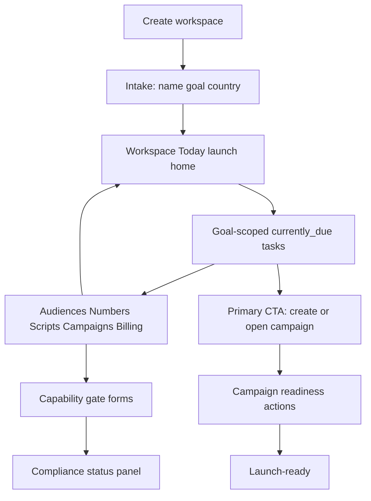

# CallCaster Business Onboarding Simplification Plan

**Date:** 2026-07-17  
**Prepared from:** Research plan *Simplify CallCaster Business Onboarding*; current-state map of `/workspaces/:id/onboarding`; industry benchmark (Stripe, Shopify, Twilio, HubSpot, Square)  
**Companion artifacts:** Cursor plan `simplify_business_onboarding_53c3a078`; research canvas `b2b-onboarding-patterns-2026.canvas.tsx`  
**Status:** Corrected 2026-07-18 — short intake + Today-as-primary-path rejected; restore always-required business basics + path wizard  
**Primary outcome:** Workspace completes business identity, picks a goal, then finishes a **goal-scoped wizard** through launch-ready  
**Execution boundary:** Onboarding UX/state, Workspace Today soft handoff, readiness gating, contextual compliance at capability boundaries. Does not rewrite Twilio Trust Hub / A2P provisioning internals.

---

## 1. Locked product decisions

### D1 — Direction: always-required core + path wizard

**Chosen:** Keep the linear onboarding wizard for path setup. Do not replace path steps with Today-only checklist work.

| Phase | What |
|-------|------|
| Always required | Workspace name → **Business basics** → Goal (+ SMS compliance fields when goal needs them) |
| Path wizard (goal-scoped) | Audience → First number → Script (IVR/SMS) → Campaign → Credits → Launch |
| Soft home | After business+goal, sidebar unlocks; Today can show a checklist that **returns to `/onboarding?step=…`** |
| Capability gates | Service/emergency address at number rental; extra SMS gates as needed |

**Rejected:** Short intake (name → goal → country) that exits to Workspace Today as the primary setup surface for audience/number/script/campaign.

### D2 — Hard gates (`currently_due` vs deferred)

| Item | Classification | Behavior |
|------|----------------|----------|
| Workspace name | Required prefix | Blocks leaving intro |
| Business profile baseline | Required prefix | Legal name, website, use-case, samples, operating country, shared contact fields — before goal |
| Goal (`live_call` / `ivr` / `sms_blast`) | Required prefix | Unlocks path steps + channels |
| TFV / A2P fields | Required when SMS goal needs them | Collected on goal step / SMS path before continuing |
| Audience / contacts | Path wizard | Guided step; product surfaces linked from wizard |
| Phone number | Path wizard | Guided step; rental blocked without service address when required |
| Script | Path wizard for `ivr` / `sms_blast` | Omitted for `live_call` |
| Campaign record | Path wizard | Create from wizard link-out |
| Credits | Warning / eventually | Wizard step + Today may prioritize `add_credits` at ≤ 0 |
| Emergency / service address | At number rental | Not a substitute for business basics |

### D3 — Redirect and sidebar policy

| Phase | Redirect | Sidebar |
|-------|----------|---------|
| Core incomplete (business baseline or goal missing) | Hard redirect owners/admins to `/onboarding` | Locked / onboarding chrome |
| Core complete, path wizard incomplete | **No** hard lock; soft banner + Today `continue_setup` → `/onboarding` | Visible |
| Capability action missing data | Hard block that action with contextual form | Visible |

### D4 — Primary CTA after core setup

1. Prefer **Continue setup** → `/onboarding` (or next incomplete `?step=`).
2. Today checklist items deep-link to matching wizard steps.
3. Credits ≤ 0 may still outrank as `add_credits` on Today.

---

## 2. Commander's intent

1. **Collect business identity up front** — every workspace gets baseline business data before path work.
2. **Keep path setup guided** — IVR/SMS/live-call differences stay in the onboarding wizard, not only a Today checklist.
3. **Do real work in real surfaces** — wizard link-outs open audiences, numbers, scripts, campaigns, billing; progress auto-completes from product state.
4. **Unlock the workspace after business + goal** — missing number/address alone does not imprison navigation.
5. **Reuse readiness sources of truth** — predicates, campaign readiness, Today selection.
6. **Keep compliance visibility** — status on Today/settings plus contextual gates.

This plan does not replace Trust Hub provisioning jobs, billing ledger rules, or the design-system surface remediation plan.

---

## 3. Key results / definition of done

| ID | Result | Verification |
|----|--------|--------------|
| KR-1 | Intake collects only name, goal, country before launch checklist | Unit + E2E ONB intake |
| KR-2 | After intake, sidebar remains visible; hard redirect only for incomplete intake | `workspace-sidebar-onboarding-gating` + readiness tests |
| KR-3 | Today shows goal-scoped launch checklist with event-driven completion | `workspace-today` + new checklist tests |
| KR-4 | Business mega-form fields are absent from intake; TFV/A2P/address appear at capability gates | UI tests for intake vs number purchase vs SMS gate |
| KR-5 | Number is currently_due for launch/start, skippable for exploration | Checklist + campaign start gate tests |
| KR-6 | Credits are warning/deferred, not a wizard step | Today + checklist tests |
| KR-7 | Compliance status (draft / in review / rejected) visible with remediation | UI + handler smoke |
| KR-8 | Legacy wizard step deep links redirect into intake or Today checklist | Loader redirect tests |
| KR-9 | Focused tests + `npm run ci:local` green for touched surface | CI |

---

## 4. Current-state summary (baseline)

**Route:** [`app/routes/workspaces+/$id/onboarding.route.tsx`](../../app/routes/workspaces+/$id/onboarding.route.tsx)  
**Wizard:** [`OnboardingWizard.tsx`](../../app/routes/workspaces+/$id/onboarding/OnboardingWizard.tsx)  
**Steps:** `business_profile` → `path_selection` → audience → first_number → [script] → campaign_info → credits → `launch_checks` ([`goals.ts`](../../app/lib/messaging-onboarding/goals.ts))  
**Persistence:** `workspace.twilio_data.onboarding` via messaging-onboarding persistence  
**Actions:** [`platform-onboarding.server.ts`](../../app/lib/platform-onboarding.server.ts) / [`onboarding-actions.server.ts`](../../app/lib/onboarding-actions.server.ts)  
**Gating:** `$id.tsx` hides sidebar when strip active or `shouldRedirectToOnboarding`; `$id.loader` redirects admins to onboarding  

Pain to remove: mega business form before goal; link-out checklist cards; sidebar prison; unused A2P props; skip vs progress mismatch.

---

## 5. Target architecture

> ## ⚠️ SECTIONS 5 AND 6 DESCRIBE A REJECTED DESIGN — DO NOT BUILD FROM THEM
>
> The short-intake / "Today as primary path" architecture below was **rejected on
> 2026-07-18** (see the Status line at the top of this file). It was never built,
> and the KRs in §3 score the shipped code as failing because they measure the
> rejected design, not the one that shipped.
>
> **What actually shipped** (verified in code 2026-07-30): a goal-first wizard —
> `path_selection` → `business_identity` → goal-scoped checklist steps, per
> `wizardStepsForGoal` in `app/lib/messaging-onboarding/goals.ts`. The wizard body
> was *not* replaced; `/onboarding` is not a thin shell; Today is not the primary
> path after intake.
>
> Two later corrections also apply and are not reflected below:
> - The intake gate is `BUSINESS_IDENTITY_REQUIRED_FIELDS` (legal business name
>   only). It previously demanded four fields the wizard never collected for
>   non-SMS goals, which trapped those workspaces in onboarding permanently.
> - `websiteUrl` is optional at intake; messaging channels still require it via
>   the per-channel readiness predicates.
>
> Retained for the rationale in §1–§4 and the research context. If you need the
> current shape, read the code named above, not this section.

### Layer A — Intake (keep `/onboarding` as thin shell)

Replace multi-step wizard body with:

1. Name (existing `OnboardingIntroStep` / `save_workspace_name`)
2. Goal + operating country (slim `save_channels` / new `save_intake`)

Persist: `selectedGoal`, `operatingCountry`, derived `selectedChannels` via `channelsForOnboardingGoal`, `status: collecting_business` or new `intake_complete`, `currentStep` deprecated for UI (keep for API compat).

Redirect to `/workspaces/:id` (Today).

### Layer B — Launch checklist on Today

Extend [`selectWorkspaceToday`](../../app/lib/workspace-today.server.ts) / Today UI:

- New server helper e.g. `app/lib/workspace-launch-checklist.server.ts` (or non-server predicates module if shared with client).
- Items from D2, goal-scoped.
- Each item: `{ id, label, complete, href, due: 'currently' | 'eventually' | 'warning' }`.
- Completion from existing counts: audiences, numbers, scripts, campaigns, credits, campaign readiness.

UI: flat `Section` checklist on [`WorkspaceToday.tsx`](../../app/components/workspace/WorkspaceToday.tsx) (also flatten Card nesting per design-system audit when touching this file).

### Layer C — Capability gates

| Gate | Mount point | Fields / actions |
|------|-------------|------------------|
| Service address | Number purchase / rent flow | Street, city, region, postal, country; reuse emergency voice persist + review |
| SMS compliance | When goal/SMS number type needs TFV or A2P | Existing inline fields from `OnboardingGoalStep`, moved here |
| Business identity for SMS | Before TFV/A2P submit | legal name, website, use case, samples |
| Go-live | Campaign start | Campaign readiness codes |

Reuse handlers: `save_business_profile` (narrowed), `review_emergency_voice`, `provision_a2p`, compliance job enqueue.

### Layer D — Compliance status

Compact panel on Today and/or Settings:

- Channel statuses from onboarding state (`a2p10dlc`, toll-free, emergency voice)
- Blocking issues + last error (wire the unused `a2pBlockingIssues` / `a2pErrors`)
- CTA: complete requirements / view details

### Deprecated UI (after migration)

- Linear `OnboardingProgressStrip` step badges as primary progress (replace with Today checklist progress / soft banner)
- `OnboardingChecklistLinkStep` as wizard steps
- `OnboardingCreditsStep` as a wizard page
- `OnboardingLaunchStep` as a wizard page (logic moves to Today + campaign readiness)
- Full `OnboardingBusinessBasicsStep` as step 1 (split into gates)

Keep route module and API actions for backward compatibility; deep links `?step=*` map to Today or the relevant gate.

---

## 6. Implementation waves

### Wave 0 — Model and redirects (foundation)

**Exit criteria:** Intake-incomplete is the only hard workspace redirect; readiness API distinguishes intake vs launch warnings.

| Task | Files |
|------|-------|
| Introduce intake-complete predicate (goal + country set; name non-empty) | `predicates.ts` or new `intake.ts`; `readiness.server.ts` |
| Narrow `shouldRedirectToOnboarding` (or rename) to intake-incomplete | `readiness.server.ts`, `$id.loader.server.ts`, `$id.tsx`, tests |
| Stop treating `emergency_address_present` / `first_number_present` as redirect causes | `readiness.server.ts`, `messaging-onboarding.server.test.ts` |
| Add `workspace-launch-checklist` builder from goal + workspace counts | new lib module + unit tests |
| Persist intake via existing or new action without requiring business mega-form | `platform-onboarding.server.ts`, `onboarding-actions.server.ts` |

### Wave 1 — Intake + Today checklist (user-visible simplification)

**Exit criteria:** KR-1, KR-2, KR-3; e2e covers intake → Today checklist.

| Task | Files |
|------|-------|
| Slim onboarding route to intake-only UI | `onboarding.route.tsx`, `OnboardingWizard.tsx`, intro + goal steps |
| Move country onto goal/intake; remove business mega-form from default path | `OnboardingGoalStep.tsx`, remove/gate `OnboardingBusinessBasicsStep` |
| Strip TFV/A2P fields from goal step | `OnboardingGoalStep.tsx` |
| Render launch checklist on Today | `WorkspaceToday.tsx`, `$id` loader data plumbing, copy helpers |
| Point `continue_setup` at Today or intake, not full wizard | `workspace-today.server.ts`, `workspace-today-copy.ts`, tests |
| Soft banner for incomplete launch checklist | `$id.tsx` |
| Legacy `?step=` redirects | `onboarding.loader.server.ts`, `wizard-step-resolution.ts` |
| Update e2e `e2e/specs/onboarding.spec.ts` | intake + Today |

### Wave 2 — Capability gates + campaign-first CTA

**Exit criteria:** KR-4, KR-5, KR-6; number/SMS gates collect deferred fields.

| Task | Files |
|------|-------|
| Service address gate on number purchase | numbers purchase UI + actions; emergency voice server |
| SMS compliance gate when selecting toll-free / US SMS | numbers or campaign SMS settings; reuse form field builders from onboarding-actions |
| Primary CTA prefers campaign create/settings | `workspace-today.server.ts`, launch checklist |
| Harden campaign start on missing number (currently_due) | campaign readiness / start path |
| Credits as warning row only | checklist + Today priority unchanged for balance ≤ 0 |
| Tests for gates and start blocks | route + UI tests |

### Wave 3 — Compliance lifecycle surface + cleanup

**Exit criteria:** KR-7, KR-8, KR-9.

| Task | Files |
|------|-------|
| Compliance status panel (Today/settings) | new component; wire A2P/TFV/emergency statuses |
| Remedioation CTAs into gates | status panel |
| Delete or quarantine dead wizard steps / unused props | onboarding components, route |
| API docs / OpenAPI onboarding notes if public surface changes | `openapi.ts` if needed |
| Full `ci:local` | — |

---

## 7. File touchpoint matrix

| Area | Primary files | Tests |
|------|---------------|-------|
| Intake UI | `onboarding.route.tsx`, `OnboardingWizard.tsx`, `OnboardingIntroStep.tsx`, `OnboardingGoalStep.tsx` | `test/ui/onboarding-*.tsx`, e2e onboarding |
| Actions | `platform-onboarding.server.ts`, `onboarding-actions.server.ts`, `onboarding/onboarding-persist.server.ts` | `test/onboarding-*.test.ts` |
| Readiness / redirect | `messaging-onboarding/readiness.server.ts`, `predicates.ts`, `$id.loader.server.ts`, `$id.tsx` | `messaging-onboarding.server.test.ts`, sidebar gating UI test |
| Launch checklist | **new** `workspace-launch-checklist.ts` (+ `.server` if needed), `WorkspaceToday.tsx`, `workspace-today.server.ts`, `workspace-today-copy.ts` | `workspace-today.test.ts`, new checklist tests, `workspace-today` UI test |
| Goals / channels | `messaging-onboarding/goals.ts`, `campaign-goals.ts` | `messaging-onboarding-goals.test.ts` |
| Number / address gate | `settings/numbers.*`, emergency-voice server, purchase components | numbers / emergency tests |
| Campaign readiness | `campaign-readiness-actions.ts`, campaign settings / new | `campaign-readiness-actions.test.ts`, launch review UI |
| Compliance panel | new UI + onboarding state fields | UI test + handler smoke |
| Progress chrome | `OnboardingProgressStrip.tsx` | Retarget or remove per Wave 1 |

**Do not** swap server readiness evaluation for client-only projections. Checklist completion for gated capabilities must use the same predicates the send/start paths use.

---

## 8. State / migration notes

- Keep `twilio_data.onboarding` versioned blob; prefer additive fields over breaking renames.
- Map legacy `currentStep` values through `LEGACY_WIZARD_STEP_REDIRECTS` → Today or intake.
- Workspaces mid-wizard: if `selectedGoal` set, treat intake complete and show checklist; if business profile partially filled, retain data for later gates.
- Members remain read-only for mutations; Today checklist still visible with “ask an admin” where actions are admin-only.
- Public API `PATCH/POST onboarding` remains; document intake vs capability actions.

---

## 9. Test plan

### Automated

- Unit: intake-complete predicate; launch checklist builder per goal; readiness redirect narrowed; Today CTA priority with checklist.
- UI: intake screens; Today checklist completion states; sidebar visible after intake; capability gate forms.
- E2E: ONB intake happy path → Today checklist visible; deep link legacy step; member read-only.
- Final gate: `npm run ci:local` on the implementation branch.

### Manual (review / local)

1. New workspace: name → goal → country → land on Today under 2 minutes.
2. Confirm sidebar works; open audiences/campaigns without trap redirect.
3. Create audience, number (address gate appears on rent), script, campaign; checklist ticks.
4. SMS blast + US/CA: compliance fields appear at the right moment only.
5. Zero credits: warning + Today billing priority; checklist not a dead end.
6. Compliance reject/in-review: status visible; workspace still navigable.

### Regression risks

| Risk | Mitigation |
|------|------------|
| Legacy workspaces stuck redirecting | Migrate redirect predicate; e2e + readiness tests |
| Number rent without address breaks voice compliance | Gate at purchase; keep `review_emergency_voice` |
| Campaign start without number | currently_due hard block on start |
| API clients posting `save_business_profile` as step 1 | Keep action; stop requiring it for intake advance |
| Design-system nested Card on Today | Flatten while editing `WorkspaceToday` |

---

## 10. Repository invariants

- Tenant data via `createTenantDb` only in route/server product code.
- No `.env` edits.
- Prefer `app/components/ui` + flat `Section` in workspace panel.
- Exhaustive switches on goal / due classification unions.
- Imports at top of file.
- User-facing copy: positive framing (no negative ontology).

---

## 11. Suggested PR slices

1. **PR A (Wave 0):** readiness/intake predicates + redirect meaning change + checklist builder (tests only / minimal UI).
2. **PR B (Wave 1):** intake UI + Today checklist + sidebar unlock.
3. **PR C (Wave 2):** number address gate + SMS compliance gate + campaign-first CTA.
4. **PR D (Wave 3):** compliance status panel + dead wizard cleanup + e2e expansion.

---

## 12. Out of scope

- Rewriting Twilio A2P / Trust Hub job internals
- RCS productization beyond status plumbing
- Full design-system audit remediation (coordinate with `component-surface-remediation-plan-2026-07-17.md` when touching Today)
- Changing credit ledger / Stripe checkout

---

## 13. Decision log (summary)

| ID | Decision |
|----|----------|
| D1 | Option 1 + campaign-first bias |
| D2 | Number currently_due for launch/start; credits eventually_due+warning; emergency address at rental; SMS/A2P at capability |
| D3 | Hard redirect only for incomplete intake; sidebar visible after |
| D4 | Primary CTA → campaign create/settings when possible |
