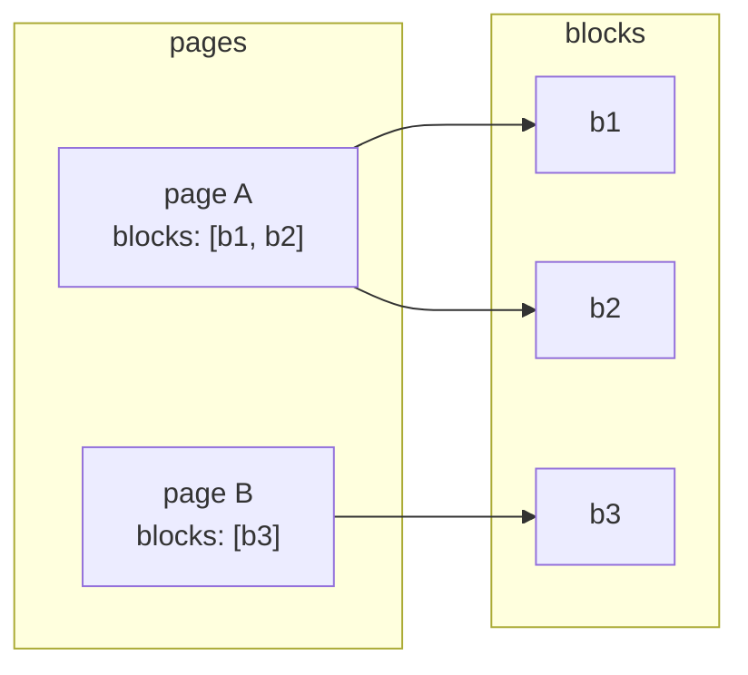

# Campaign script structure

This document explains how CallCaster represents a **campaign script** in data: where it lives, how **pages** and **blocks** fit together, and how **navigation** works at runtime (especially IVR).

For field-by-field JSON examples and upload-oriented rules, see **[Script JSON format](script-json-format.md)**. For a standalone validator you can run in Node or the browser, see **[`docs/script-validator.js`](script-validator.js)**.

## Where the script lives

- In the database, a script row stores a JSON document on **`steps`** (see `script` table / `Script` type).
- The app’s campaign script editor reads and writes **`steps`** as an object with at least:
  - **`pages`**: map of page id → page metadata and ordered block list
  - **`blocks`**: map of block id → block definition

The editor normalizes this shape in [`CampaignSettings.Script.tsx`](../app/components/campaign/settings/script/CampaignSettings.Script.tsx): if `steps` is missing or not an object, it treats `pages` / `blocks` as empty objects.

## Top-level shape

```json
{
  "pages": {
    "<pageId>": {
      "id": "<pageId>",
      "title": "Section title",
      "blocks": ["block_a", "block_b"]
    }
  },
  "blocks": {
    "<blockId>": {
      "id": "<blockId>",
      "type": "...",
      "title": "...",
      "content": "...",
      "options": [],
      "audioFile": ""
    }
  }
}
```

- **`pages`** and **`blocks`** are both **objects** keyed by id. Keys should match each entity’s **`id`** field (the validator warns when they differ).
- Each **page** owns an ordered array **`blocks`**: those strings must be keys that exist in **`blocks`**.

## Pages

| Role | Details |
|------|--------|
| **Purpose** | Group blocks into sections and define **linear order** within the section. |
| **Order** | `page.blocks[0]` is the first block on that page; `page.blocks[1]` is next, and so on. |
| **Ids** | `id` should match the key used under `pages`. |

IVR entry for a page uses the first block in that list (see [`api.ivr.$campaignId.$pageId`](../app/routes/api.ivr.$campaignId.$pageId.tsx)).

## Blocks

Common fields (see [Script JSON format](script-json-format.md) for the full tables):

| Field | Meaning |
|-------|--------|
| **`id`** | Stable id; must match the key in `blocks`. |
| **`type`** | Drives UI and runtime (e.g. `textarea`, `select`, `radio`, `checkbox` for conversational scripts; IVR often uses `synthetic` or `recorded`). |
| **`title`**, **`content`** | Labels and main text. |
| **`options`** | For interactive types: choices with **`next`** targets (see below). |
| **`audioFile`** | IVR / audio-backed flows: text for `synthetic` or storage path for `recorded` (see [`api.ivr.$campaignId.$pageId.$blockId`](../app/routes/api.ivr.$campaignId.$pageId.$blockId.tsx)). |

Interactive options also carry a **`value`** for IVR (DTMF or speech mapping), including the sentinel **`vx-any`** for “any voice input” (see [`api.ivr.$campaignId.$pageId.$blockId.response`](../app/routes/api.ivr.$campaignId.$pageId.$blockId.response.tsx)).

## How navigation works

### 1. Linear flow (default)

If a block has **no** `options` (or an empty list), the IVR runtime moves to the **next block on the same page** (`blocks` index + 1). If there is no next block on the page, it continues to the **first block of the next page** in `Object.keys(script.pages)` order.

So **page order** in the `pages` object matters for linear segments, and **array order** inside each `page.blocks` matters within the page.

### 2. Branching via `option.next`

When the caller’s input matches an option, **`next`** is interpreted by [`handleNextStep`](../app/routes/api.ivr.$campaignId.$pageId.$blockId.response.tsx) roughly as:

| `next` value | Effect |
|--------------|--------|
| **`hangup`** | End the call. |
| **Contains `:`** (e.g. `page_2:block_3`) | Redirect to that page and block. |
| **Starts with `page_`** | Treated as a **page id**; redirect to that page’s entry (first block). |
| **Otherwise** | Treated as a **block id on the current page**; redirect to that block. |

The **IVR** script UI typically sets **`next`** to another **page id** or **`hangup`** ([`CampaignSettings.Script.IVRQuestionBlock.tsx`](../app/components/campaign/settings/script/CampaignSettings.Script.IVRQuestionBlock.tsx)). The **call / question-block** UI may also use **`end`** or **`page_<pageKey>`** style values ([`CampaignSettings.Script.QuestionBlock.Option.tsx`](../app/components/campaign/settings/script/CampaignSettings.Script.QuestionBlock.Option.tsx)); when authoring for **IVR**, prefer **`hangup`** and page ids that match your `pages` keys so Twilio redirects resolve correctly.

### 3. Validation vs runtime

[`docs/script-validator.js`](script-validator.js) focuses on structural checks (required fields, option `next` pointing at existing **blocks** or `end`, cycles, etc.). The **live IVR** runtime uses the rules above (`hangup`, `:`, `page_` prefix, or block id). If you mix campaign types, validate against the path you actually use (IVR webhooks vs uploads).

## Mental model



- **Pages** choose **which blocks exist in a section** and in **what order** for linear playback.
- **Blocks** hold content and optional **branches** via **`options[].next`**.
- **Cross-page** moves are either implicit (linear advance to the next page) or explicit (`next` pointing at a page or `pageId:blockId`).

## Related npm scripts (repository tooling)

The [`scripts/`](../scripts/) directory holds **Node** helpers (not campaign JSON):

| Path | Role |
|------|------|
| [`scripts/local/dev-stable.mjs`](../scripts/local/dev-stable.mjs) | Stable local dev: Remix watch + app restart (wired as `npm run dev`). |
| [`scripts/local/sync-calling-dev.mjs`](../scripts/local/sync-calling-dev.mjs) | Sync Twilio / workspace URLs for local calling (`npm run dev:calling:sync`). |
| [`scripts/coverage/merge-and-check.mjs`](../scripts/coverage/merge-and-check.mjs) | Merge Vitest + Deno LCOV and enforce coverage gates. |
| [`scripts/configure-verification-number.mjs`](../scripts/configure-verification-number.mjs) | Point a verification number’s Voice URL at `/api/inbound-verification`. |
| [`scripts/dev/websocket-server.js`](../scripts/dev/websocket-server.js) | Optional TLS WebSocket dev server + certs under `scripts/dev/certs/`. |

See root [`package.json`](../package.json) `scripts` for the exact `npm run` names.
