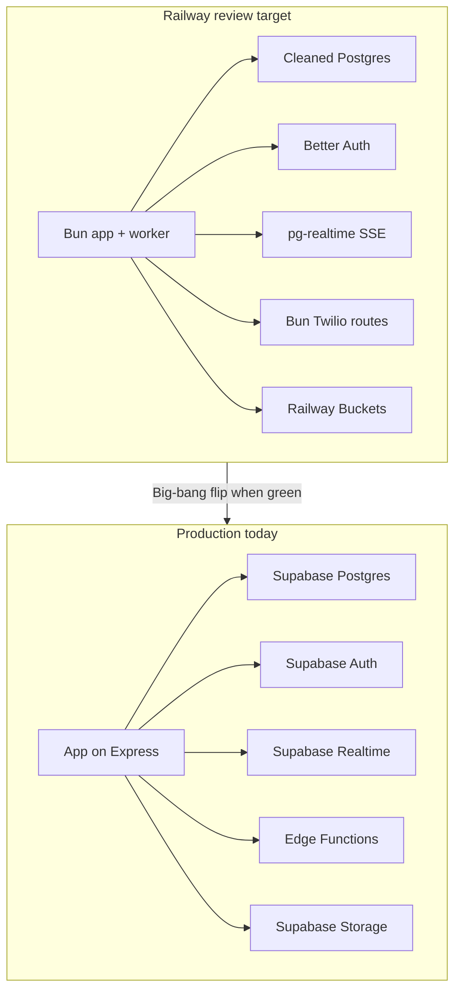

> **Canonical migration plan** — grilled 2026-06-29; orchestration started 2026-06-29; **Sprint 2 progress synced 2026-06-29 (queue + survey ports)**.  
> **Branch:** `feat/supabase-postgres-migration`  
> **Railway target:** [`visual-asset-review`](./railway-review-env.md) — [dashboard](https://railway.com/project/32b36c6c-5f3d-463b-8c7f-bbcd70351e8f?environmentId=18ef9173-4b33-4a62-9b94-9dfc7a36eb05)  
> **Track progress:** [`migration-delivery-board.md`](./migration-delivery-board.md) · [`migration-orchestration.md`](./migration-orchestration.md)

# Supabase → Postgres Migration — Leftover Work Plan

**Grilled 2026-06-29** (rounds 1–3). This plan supersedes the phased-strangler ordering in the first draft. See [Resolved decisions](#resolved-decisions-grill-2026-06-29) below.

---

## Execution status (2026-06-29, Sprint 2)

| Phase | Status | Notes |
|-------|--------|-------|
| **0** — Ledger audit & local stack | **Done** | Ledger 34/34 on Railway `PostgreSQL 18` |
| **1** — Schema transform | **Mostly applied** | 01–05, 08, 08b, 10 on review; baseline dumped; **06/07/09** pending (SSE/worker) |
| **1D** — Scriptkit packages | Not started | CHS monorepo upstream |
| **2** — Drizzle port | **In progress** | **9/13** modules done; **153** PostgREST `.from("…")` sites in **81** files remain (telephony API, hooks/realtime, create-with-script) |
| **3** — Staging stack (3A–3F) | Not started | **3D partial** — Remix sms-status live; Edge IVR unified `campaign` select |
| **4** — Staging gate | Blocked | Requires Phases 2–3 |
| **5** — Prod big-bang | Blocked | Requires Phase 4 |
| **6** — Docs cleanup | Not started | Requires Phase 5 |

**Workstreams:** WS-A (schema) · **WS-B (Drizzle — active)** · WS-C (v2 stack) · WS-D (scriptkit) · WS-E (households)

**Gate criteria:** G0 ✓ · G1 mostly ✓ · G2–G6 pending — see [`migration-delivery-board.md`](./migration-delivery-board.md)

---

## Resolved decisions (grill 2026-06-29)

### Cutover & infrastructure

| Decision | Choice |
|----------|--------|
| Schema cleanup timing | **Railway review/staging first** — prod Supabase Postgres untouched until big-bang |
| Production cutover model | **Single big-bang** — Postgres + Auth + Realtime + Edge + Storage together |
| Cutover gate | **Staging green first** (77/77 E2E + manual Twilio smoke), then **hard read-only maintenance window** |
| Railway prod DB | **Promote review Postgres** that passed staging (final Supabase delta if drifted) |
| Migration history | **Squashed `drizzle/0000_baseline.sql`** from post-cleanup schema; **archive** `supabase/migrations/`; forward DDL via **drizzle-kit generate** |
| Runtime | **Bun** for web + worker in big-bang; **media-stream service deferred** post-cutover (ADR-0027–0030) |
| CHS packages | **`@chester-hill-solutions/*` from GitHub Packages** (not vendored, not inline) |
| Storage | **Block flip until** all Supabase Storage objects copied to Railway Buckets + DB paths updated |
| Testing | **PGlite per test file** + drizzle-kit push for tenant-db / database.server tests (Phase 2) |
| Local dev | **`docker-compose.dev.yml`**: Postgres + MinIO + Inbucket; Bun dev natively; squashed baseline via drizzle-kit push |
| Prod during staging build | **Freeze prod schema** on hosted Supabase — no prod migrations until big-bang; hotfixes must be code-only |
| E2E factories | **Rewrite** [`e2e/fixtures/factories.ts`](e2e/fixtures/factories.ts) to Drizzle/admin-db before staging gate |
| Twilio webhook repoint | **Automated** workspace sync + webhook audit before flip; staging dry-run required |
| pg_cron | **Worker replaces all 3 jobs before staging gate**; drop pg_cron from squashed baseline |
| Platform API | **URL/behavior compatible** at cutover; `tools:api:surface:check` green on Railway review |
| Repo strategy | **In-place** on `callcaster/` — revise ADR-0008 to deprecate `callcaster-v2` fork narrative |

### Schema transform (squashed baseline)

| Decision | Choice |
|----------|--------|
| Campaign consolidation | **`campaign` table with type-gated nullable columns** + Zod per `campaign.type` |
| `campaign_queue.status` | **Drop** — `queue_state` + `assigned_to_user_id` + `provider_status` only |
| `call` / `message` (ADR-0015) | **Full apply** — domain `id` PK, `twilio_sid` indexed, `parent_call_id` FK, drop Twilio noise columns |
| `contact` columns | **Drop** `fullname`, `carrier`, `address_id`; compute display name from firstname/surname |
| `workspace.twilio_data` | **Split** → `workspace_twilio_config` + `workspace_onboarding` + `workspace_sync_snapshot` |
| `user.activity` + `workspace.users` | **Drop** when SSE + `agent_status` replace `useSupabaseRoom` heartbeat (required before staging gate) |
| Vestigial tables | Drop: `email`, `email_campaign`, `audience_rule`, `campaign_schedule_jobs`, `twilio_cancellation_queue`, `workspace_permissions`, `phone_verification` |
| RCS onboarding | **Drop** from baseline (ADR-0008); remove from messaging-onboarding normalize |
| Caller ID verification | **Keep** `verification_session` + `user.verified_audio_numbers` + call-in flow; **drop** PIN/`phone_verification` only |
| Survey tables | **Keep relational tables** in baseline; logic moves to scriptkit packages (below) |
| Households (ADR-0021) | **Schema + call-screen wiring** in baseline; **`household_key`** canonical (quick-canvass style); backfill + `contact.household_id` FK; replace address-string queue grouping |

### Auth, scriptkit, scope

| Decision | Choice |
|----------|--------|
| Auth at flip | **Better Auth** + **one-time session invalidation**; bcrypt import; 2FA for owner/admin/field_director |
| User data model | **Better Auth tables** for credentials/sessions + **`public.user` profile extension** (same UUID) |
| Scriptkit packages | **GitHub Packages only** — publish `scriptkit-call-script-*` + new `scriptkit-survey-*`; **remove `vendor/scriptkit/`** before gate |
| Scriptkit vision | **Canonical builder** for scripts, surveys, forms (enhance CHS monorepo upstream as needed) |
| Big-bang scriptkit gate | **Call scripts** on `scriptkit-call-script-*` + **new `scriptkit-survey-core` / `scriptkit-survey-react`**; delete inline survey editor/utils |
| Live transcription | **Defer** media-stream Railway service to post-cutover fast-follow (ADR-0027–0030) |
| Vestigial Edge fn deletes | Delete: `update_audience_membership`, `create_schedule_jobs`, `cancel_calls`, `call-server`, other dead stubs per ADR-0009 |

---

## Current state (baseline)

**Done (pre-migration slices):** Slices 0–10 + Slice 11 Phases 1–2 ([`docs/build-against-docs-plan.md`](docs/build-against-docs-plan.md))

- Drizzle foundation: [`app/db/schema.ts`](app/db/schema.ts), [`app/server/db.ts`](app/server/db.ts), [`createTenantDb`](app/server/tenant-db.ts)
- Credits RPC, RLS dropped, tenant-db tests
- Railway review env: Postgres dump/restored (prior session)

**Done (orchestration — 2026-06-29):**

- Phase 0: [`migration-ledger-audit.md`](./migration-ledger-audit.md), `npm run db:ledger:check`, [`docker-compose.dev.yml`](../docker-compose.dev.yml), ledger **34/34** on Railway review
- Phase 1 SQL: [`scripts/schema-transform/`](../scripts/schema-transform/) (`00`–`10`); **mostly applied** on review; [`drizzle/0000_baseline.sql`](../drizzle/0000_baseline.sql) (6951 lines); migrations archived to [`docs/archive/supabase-migrations/`](./archive/supabase-migrations/)
- Phase 1 app: unified `campaign` runtime (IVR Remix routes, export, create/settings); `campaign-ivr.server.ts`; `workspace-scoped-tables.ts` (22 tables)
- Phase 2 (partial): tenant-db ports for workspace, campaign, contacts, dial stack, messaging; see [Phase 2 progress](#phase-2--drizzle-data-access-port-against-cleaned-schema) below
- Inventories: [`phase-2-drizzle-port-inventory.md`](./phase-2-drizzle-port-inventory.md), [`phase-3-stack-gap-analysis.md`](./phase-3-stack-gap-analysis.md)
- Branch: `feat/supabase-postgres-migration`

**Remaining (G2 exit):**

- ~**162** `database.types` imports; delete [`database.types.ts`](app/lib/database.types.ts) last
- **153** PostgREST `.from("…")` call sites across **81** `app/` modules (heavy: telephony API routes, `create-with-script`, realtime hooks, workspace loaders)
- **Server `campaign_queue` reads/writes:** Drizzle via [`campaign-queue-db.server.ts`](app/lib/campaign-queue-db.server.ts) — only [`useSupabaseRealtime.ts`](app/hooks/realtime/useSupabaseRealtime.ts) still PostgREST on `campaign_queue` (Phase 3B SSE)
- **Enqueue/dequeue RPCs** (`dequeue_contact`, `select_and_update_campaign_contacts`, `enqueueContactsForCampaign`, …) stay Supabase until worker/RPC wrappers land
- **Survey server PostgREST:** done — [`survey-db.server.ts`](app/lib/survey-db.server.ts)
- Supabase Auth/Realtime/Edge/Storage; Express runtime; transforms **06/07/09** on review



---

## Phase 0 — Migration ledger audit (read-only on prod) ✓

**Goal:** Understand history before any prod DDL. No schema changes on hosted Supabase.

**Delivered:**

- [`migration-ledger-audit.md`](./migration-ledger-audit.md) — 34 migrations inventoried; parity files flagged
- [`scripts/db/check-migration-ledger.mjs`](../scripts/db/check-migration-ledger.mjs) — `npm run db:ledger:check`
- [`docker-compose.dev.yml`](../docker-compose.dev.yml) — local Postgres + MinIO + Inbucket

**Remaining:**

- ~~Run `DATABASE_URL=... npm run db:ledger:check` against Railway review~~ ✓ (34/34, 2026-06-29)
- Ledger version = numeric prefix before `_` in filename (e.g. `202604140001`, `20260628130500`)

---

## Phase 1 — Railway review: schema transform + squashed baseline

**Goal:** Clean schema exists only on Railway review until prod flip.

**Status:** SQL scripts drafted (`00`–`10`). **Mostly applied** on Railway review; squashed baseline generated.

### 1A. Seed Railway review from prod

Target environment: **[`visual-asset-review`](./railway-review-env.md)** on CallCaster (`PostgreSQL 18` service).

- `pg_dump` hosted Supabase → Railway review Postgres (refresh before final cutover too).
- Link CLI: `railway environment visual-asset-review` → service `PostgreSQL 18`.

### 1B. Schema transform on Railway only

Apply via [`scripts/schema-transform/apply-all.sh`](../scripts/schema-transform/apply-all.sh) (review DB only):

| Step | Script | Status |
|------|--------|--------|
| 00 | `00-preflight.sql` | Applied |
| 01 | `01-drop-vestigial.sql` | Applied |
| 02 | `02-consolidate-campaign.sql` | Applied — backfill review ongoing |
| 03 | `03-normalize-campaign-queue.sql` | Applied — RPC rewrites still needed in app |
| 04 | `04-contact-prune.sql` | Applied |
| 05 | `05-drop-rcs-onboarding.sql` | Applied (app-layer RCS; no DDL columns) |
| 06 | `06-adr-0015-call-message.sql` | **Pending** — PK swap sketch; blocked on full ADR-0015 rollout |
| 07 | `07-split-workspace-twilio-data.sql` | **Pending** — typed tables + backfill sketch |
| 08 | `08-household-key.sql` | Applied |
| 08b | household backfill (if present) | Applied |
| 09 | `09-drop-legacy-presence.sql` | **Pending** — guarded; requires Phase 3B SSE |
| 10 | `10-verify.sql` | Applied (read-only checks) |

**Known mismatches to resolve before apply:**

- `campaign_queue.dequeued_by`: migration uses `uuid`; `schema.ts` has `text` — align on review
- `02`: map `live_campaign.questions` → `campaign.live_questions` (not `call_questions`)
- Step 03: plpgsql queue RPCs still reference legacy `status` until app/RPC port

**Drop tables (+ delete callers first):**

| Table | Action |
|-------|--------|
| `email`, `email_campaign` | Drop; remove `email` from `campaign_type` enum |
| `audience_rule` | Drop; delete `update_audience_membership` Edge fn |
| `campaign_schedule_jobs` | Drop; delete `create_schedule_jobs` Edge fn |
| `twilio_cancellation_queue` | Drop; delete `cancel_calls` Edge fn |
| `workspace_permissions` | Drop |
| `phone_verification` | Drop; delete `verify-pin-input`, `verify-audio-session` routes |
| `verification_session` | **Keep** — call-in caller ID verification (`verify-call-in-session`, `inbound-verification`) |
| `user.verified_audio_numbers` | **Keep** — auto-dial device allowlist |

**Consolidate:**

- Merge `live_campaign`, `ivr_campaign`, `message_campaign` → **`campaign` with type-gated nullable columns** (dial_ratio, ivr fields, sms fields, etc.).
- Data backfill migration on review DB; update [`WorkspaceSelectedNewUtils.server.ts`](app/lib/workspace-selector/WorkspaceSelectedNewUtils.server.ts) and campaign loaders.

**Normalize queue:**

- Drop `campaign_queue.status`; RPCs + app use `queue_state` / `assigned_to_user_id` / `provider_status` only.
- Delete `UUID_STATUS_PATTERN` from [`app/lib/queue-status.ts`](app/lib/queue-status.ts).

**Other v2 pruning (verify reads first):**

- **ADR-0015:** domain `id` PK on `call`/`message`, `twilio_sid` column, drop noise columns, `parent_call_id` FK.
- Drop `contact.fullname`, `carrier`, `address_id` — compute display name in app/export.
- Split `workspace.twilio_data` → typed config/onboarding/sync tables.
- Drop `user.activity`, `workspace.users` — require `agent_status` + SSE before staging gate.

### 1C. Squashed baseline + archive

**Mostly done** — after transform applied and `10-verify.sql` passes:

- ✓ `pg_dump --schema-only` from cleaned Railway review → [`drizzle/0000_baseline.sql`](../drizzle/0000_baseline.sql) (6951 lines)
- ⚠ Regenerate [`app/db/schema.ts`](app/db/schema.ts) via `drizzle-kit introspect` — **blocked** (JSON error on PG 18); hand-synced from baseline
- ✓ Update [`app/db/workspace-scoped-tables.ts`](app/db/workspace-scoped-tables.ts) — 22 scoped tables
- ✓ Move [`supabase/migrations/`](../supabase/migrations/) → [`docs/archive/supabase-migrations/`](./archive/supabase-migrations/)
- Forward DDL: **`drizzle-kit generate`** only
- CI: `drizzle-kit check` against review DB after apply

### 1D. Scriptkit packages (CHS monorepo — blocks staging gate)

- Finish Callcaster wiring on vendored `scriptkit-call-script-*` → publish/consume from GitHub Packages.
- Add **`scriptkit-survey-core`** + **`scriptkit-survey-react`** (relational model first; pages/blocks unification is north star, not baseline blocker).
- Replace inline [`survey-utils.ts`](app/lib/survey-utils.ts) + survey route UI with package imports.
- Scriptkit is the **canonical** path for scripts, surveys, and future forms — extend upstream as needed.

---

## Phase 2 — Drizzle data-access port (against cleaned schema)

**Goal:** All tenant data via `createTenantDb`; delete `database.types.ts`.

**Inventory:** [`phase-2-drizzle-port-inventory.md`](./phase-2-drizzle-port-inventory.md) · task IDs in [`migration-delivery-board.md`](./migration-delivery-board.md) § Phase 2

### Progress (2026-06-29)

| ID | Module | Status |
|----|--------|--------|
| 2.1 | `workspace.server.ts` | **Done** — Supabase retained for auth + RPCs only |
| 2.2 | `campaign.server.ts` + `campaign-stats.server.ts` | **Done** — tenant-db; Drizzle queue counts; Supabase RPC `get_campaign_stats` only |
| 2.3 | Queue/dial stack | **Done** — see [Sprint 2 helpers](#sprint-2-telephony--messaging-helpers) |
| 2.4 | Contacts + audiences | **Done** |
| 2.5 | Messaging + chats | **Done** — sms-send, inbound-sms, credits gates |
| 2.6 | Billing + ledger | **Partial** — `stripe.server.ts` + `billing-reconciliation.server.ts` on tenant-db; transaction-history RPC wrappers remain |
| 2.7 | Telephony adjunct | Todo — agent_status, handset, inbound queue |
| 2.8 | Twilio config modules | **Partial** — merge/config/snapshot on Drizzle; sync module remains |
| 2.9 | Platform facades | **Done** — `platform-data.server.ts` on tenant-db/Drizzle; Supabase storage for audience-upload download only |
| 2.10 | Route stragglers | **Done** — queue UI + dial-path writes; survey routes/loaders on [`survey-db.server.ts`](app/lib/survey-db.server.ts); deleted `queue-filter-search.server.ts` |
| 2.11 | UI/hooks type cleanup | Todo |
| 2.12 | Delete `database.types.ts` | Todo — ~162 imports |
| 2.13 | E2E factories → Drizzle | Todo |

**Metrics:** 9/13 modules done · **153** PostgREST `.from("…")` sites in **81** files · **162** `database.types` imports (not zero)

### Sprint 2 telephony + messaging helpers

Shared modules introduced during dial/messaging port (use these patterns for remaining routes):

| Module | Role |
|--------|------|
| [`telephony-db.server.ts`](app/lib/telephony-db.server.ts) | Unscoped `call` lookup by SID; scoped call/outreach writes |
| [`survey-db.server.ts`](app/lib/survey-db.server.ts) | Drizzle survey CRUD, public taker flow, response/answer upserts |
| [`campaign-queue-db.server.ts`](app/lib/campaign-queue-db.server.ts) | Drizzle `campaign_queue` reads/writes (dequeue, requeue, delete, hydrate, workspace resolve) |
| [`campaign-queue-search.server.ts`](app/lib/campaign-queue-search.server.ts) | Drizzle queue list/filter/count + contact hydration for platform API |
| [`contacts/search.server.ts`](app/lib/contacts/search.server.ts) | Shared contact search `where` / PostgREST filter builders |
| [`workspace-credits.server.ts`](app/lib/workspace-credits.server.ts) | `adminDb` credit balance for dial/SMS gates |
| [`user-audio.server.ts`](app/lib/user-audio.server.ts) | `adminDb` verified audio numbers for device checks |
| [`campaign-ivr.server.ts`](app/lib/campaign-ivr.server.ts) | Unified campaign + script fetch for IVR |

**Ported routes (high level):** auto-dial, dial, dial/status, auto-dial/status, auto-dial/end, auto-dial/$roomId, ivr response, inbound-sms (message/contact), sms dispatch, ivr initiate, `/api/queues`, `/api/hangup`, settings duplicate, campaign_audience enqueue checks, campaign export contact ids, create-with-script enqueue dedupe; survey CRUD/taker (`/api/surveys`, `survey-answer`, `survey-responses`, `survey-complete`, workspace + public survey loaders).

**Test coverage:** queue/dial — `test/auto-dial*.test.ts`, `test/dial-status.route.test.ts`, `test/call-screen.server.test.ts`, `test/inbound-sms.route.test.ts`, `test/sms.route.test.ts`, `test/ivr-block-response.route.test.ts`, `test/queues.route.test.ts`, `test/campaign-queue.route.test.ts`, `test/campaign-settings.route.test.ts`; survey — `test/surveys.route.test.ts`, `test/survey-answer.route.test.ts`, `test/survey-complete.route.test.ts`, `test/survey-responses.route.test.ts`. Stubs: `test/helpers/telephony-db-stub.ts`, `tenant-db-stub.ts`.

### Remaining port order

1. **Telephony API** — `create-with-script` (7), `inbound-verification` (5), `sms/status`, `call.action`, `inbound.action`
2. **Workspace route stragglers** — contacts, analytics, settings/numbers loaders
3. **2.6 Billing** — Edge Function transaction-history paths (app paths on Drizzle RPC)
4. **2.8 Twilio sync** — `workspace-twilio-sync.server.ts`
5. **2.11 UI types** — Drizzle row types vs `database.types` drift in loaders/components
6. Typed RPC wrappers in `app/server/rpc/` where PostgREST RPC is unavoidable short-term
7. Extend [`test/tenant-db.test.ts`](test/tenant-db.test.ts); PGlite per test file
8. **Exit:** zero PostgREST `.from()` in `app/` (except Phase 3 client realtime until SSE); delete [`database.types.ts`](app/lib/database.types.ts)

**Ported in Sprint 2 (platform-data):** `listWorkspaceContactsApi`, `getContactDetailApi`, `deleteContactApi`, `listWorkspaceAudiencesApi`, `getAudienceDetailApi`, `listWorkspaceScriptsApi`, `getScriptDetailApi`, `transitionCampaignStatusApi`, `getAudienceUploadStatusApi`, `duplicateCampaignApi`, `getCampaignQueueApi`, `patchCampaignQueueApi`, `listWorkspaceSurveysApi`, `getSurveyDetailApi`, `getSurveyResponsesApi`, `exportSurveyResponsesCsv`, auth workspace resolvers.

---

## Phase 3 — Staging stack (all v2 surfaces before prod flip)

**Gap analysis:** [`phase-3-stack-gap-analysis.md`](./phase-3-stack-gap-analysis.md)

Build entirely on Railway review. Nothing ships to prod until Phase 4 passes.

### 3A. Better Auth (ADR-0010) — not started

- `@chester-hill-solutions/auth-postgres` + `auth-react-router` from GitHub Packages.
- **First file:** `app/server/auth-instance.ts` (create)
- [`app/db/auth-schema.ts`](app/db/auth-schema.ts); user import script (bcrypt from `auth.users`).
- Replace `verifyAuth`; 2FA for owner/admin/field_director.
- Keep workspace API-key auth (sha256 + `timingSafeEqual`).

### 3B. SSE realtime (ADR-0005) — not started

- `@chester-hill-solutions/pg-realtime` from GitHub Packages.
- **First file:** `app/db/schema.ts` — add `workspace_events`, `workspace_activity_log`
- `workspace_events` + `workspace_activity_log`; SSE route on `DATABASE_DIRECT_URL`.
- Replace `useSupabaseRoom`, `useSupabaseRealtime`, `useChatRealtime`.

### 3C. Job worker (ADR-0007) — not started

- **First file:** `app/db/schema.ts` — `job` table
- Port exports, audience-upload, pg_cron jobs (`twilio_open_sync`, `number_rental_billing`, `twilio_billing_reconcile`).
- Port `queue-next`, `process-audience-upload`, `handle_active_change` from Edge.

### 3D. Twilio Edge → Bun routes (ADR-0009) — partial

- Remix `/api/sms/status` live; Edge `sms-status` **still canonical** — delete after staging dry-run
- Edge IVR: `ivr-flow`, `ivr-recording`, `ivr-status` select unified `campaign(*, script:script(*))` via [`_shared/unified-campaign-script.ts`](../supabase/functions/_shared/unified-campaign-script.ts)
- **First merge:** finish Edge IVR Vitest parity; repoint Twilio webhooks on staging
- P0 webhooks remaining: `acd-router` → `app/routes/api+/`
- Port Deno tests → Vitest first where not already done
- Delete remaining Edge functions + `supabase/functions/` after Bun routes canonical

### 3E. Storage (ADR-0002) — not started

- **First file:** `app/lib/database/workspace-media.server.ts`
- Bulk copy Supabase Storage → Railway Buckets.
- Rewrite media/recording URLs in DB + verify script audio playback on staging.
- **Gate:** flip blocked until copy verified.

### 3F. Bun runtime (ADR-0001) — not started

- **First file:** `package.json` — Bun start script + `oven/bun` Dockerfile
- `react-router-serve` under Bun replaces [`server/index.js`](server/index.js) (per ADR-0001).
- Dockerfile → `oven/bun`; drop Express, buffer-polyfill, `@react-router/express`.
- Railway services: **web**, **worker**, **media-stream** (if live transcription enabled).

---

### 3G. Out of big-bang (post-cutover fast-follow)

- **Media-stream service** (ADR-0027–0030): live transcription, coaching, Deepgram WSS, third Railway process.
- **Unified scriptkit content model** (surveys/forms as pages/blocks JSON) if desired after survey packages ship.

---

## Phase 4 — Staging acceptance gate

**Do not schedule prod cutover until all pass on Railway review:**

- `npm run typecheck && npm run lint && npm run test:node && npm run test:ui` (incl. PGlite tenant-db tests)
- `npm run test:e2e` with `E2E_BASE_URL` = Railway review URL (**77/77**)
- Scriptkit: call script editor + survey create/respond/export paths on staging
- Manual smoke checklist:
  - Sign-in / re-login (Better Auth)
  - Outbound live call + Twilio status callback
  - Inbound SMS + segment billing
  - Script audio playback (Railway Buckets)
  - Stripe webhook test event
  - Predictive dial room SSE (agent offer)

---

## Phase 5 — Production big-bang cutover

**Hard maintenance window** (~30–60 min); announce 24h ahead; avoid active phone banks.

1. App **read-only** or offline.
2. Final `pg_dump` delta from hosted Supabase → Railway prod Postgres (if not using review DB promotion).
3. Flip env vars in one deploy:
   - `DATABASE_URL` / `DATABASE_DIRECT_URL` → Railway
   - Better Auth secrets; remove Supabase Auth keys
   - `BASE_URL` Twilio webhook URLs → Bun routes (not `/functions/v1/`)
   - Storage bucket URLs
4. Drop `@supabase/ssr` + `@supabase/supabase-js`; delete [`supabase.server.ts`](app/lib/supabase.server.ts).
5. Smoke tests; reopen traffic.
6. Hosted Supabase project → read-only archive 24h, then decommission.

**Expected user impact:** one-time re-login (same password); active Twilio device tokens re-mint on next call screen load.

---

## Phase 6 — Post-cutover cleanup

- Revise [`docs/adr/0008-clean-rebuild-and-cutover.md`](docs/adr/0008-clean-rebuild-and-cutover.md) → in-place big-bang model.
- Update [`CONTEXT.md`](CONTEXT.md): remove references to PIN verification; confirm Queue Entry uses normalized columns only.
- Update [`AGENTS.md`](AGENTS.md), [`docs/build-against-docs-plan.md`](docs/build-against-docs-plan.md); close GitHub #1013.
- Remove Deno from CI gate; delete `supabase/config.toml` functions section.

---

## Execution order (critical path)

```
Phase 0 (ledger audit)
  → Phase 1 (Railway schema + squashed baseline)
  → Phase 2 (Drizzle port on review)
  → Phase 3 (full v2 stack on review — parallel tracks 3A–3F)
  → Phase 4 (staging gate)
  → Phase 5 (prod big-bang)
  → Phase 6 (docs + cleanup)
```

**Parallel within Phase 3:** worker (3C) and Twilio routes (3D) can proceed alongside Drizzle port (Phase 2) once cleaned schema is stable — but Phase 4 gate requires everything integrated.

### Next actions (orchestrator)

1. **WS-B 2.7** — Telephony adjunct (`agent-status`, handset, inbound queue)
2. **WS-B survey stragglers** — `settings.loader` + `platform-analytics` → `survey-db.server.ts`
3. **WS-B 2.6** — Transaction-history RPC wrappers
4. **WS-B 2.8** — Finish Twilio sync module (`twilio-bootstrap` / open-sync)
5. **WS-C 3D** — Delete Edge `sms-status`; finish IVR handler tests + webhook repoint on staging

Full task checkboxes: [`migration-delivery-board.md`](./migration-delivery-board.md).

---

## Documentation & tooling

| Artifact | Path |
|----------|------|
| **Railway review env** | [`railway-review-env.md`](./railway-review-env.md) |
| Delivery board (task IDs) | [`migration-delivery-board.md`](./migration-delivery-board.md) |
| Orchestration status | [`migration-orchestration.md`](./migration-orchestration.md) |
| Ledger audit | [`migration-ledger-audit.md`](./migration-ledger-audit.md) |
| Phase 2 inventory | [`phase-2-drizzle-port-inventory.md`](./phase-2-drizzle-port-inventory.md) |
| Phase 3 gap analysis | [`phase-3-stack-gap-analysis.md`](./phase-3-stack-gap-analysis.md) |
| Schema transform SQL | [`scripts/schema-transform/`](../scripts/schema-transform/) |
| Ledger check | `npm run db:ledger:check` |
| Local stack | `docker compose -f docker-compose.dev.yml up -d` |

---

## Out of scope

- Design-system / softphone remediation plans (done)
- Full defect repair E1–E83 (file new issues during port)
- Public API expansion (parallel track)
- Media-stream / live transcription (post-cutover fast-follow, ADR-0027–0030)

---

## Closed grill topics (resolved 2026-06-29)

| Topic | Decision |
|-------|----------|
| RCS onboarding | **Drop** from baseline; app flag stays off |
| PIN verification | **Drop** `phone_verification`; keep call-in `verification_session` |
| Cutover model | Single big-bang after staging gate |
| Prod schema during staging | **Frozen** — code-only hotfixes |
| Scriptkit | GitHub Packages; survey packages required before gate |
| Households | `household_key` canonical; wire call screen |
