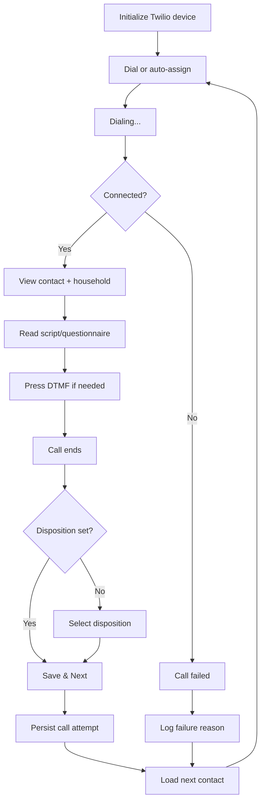

# CallCaster User Journey Audit

**Date:** 2026-06-30
**Scope:** Full audit across all user types
**Journeys mapped:** 51 | **Routes scanned:** 477 | **Components scanned:** 156

---

## Executive Summary

CallCaster serves **six distinct user types** across a React Router v7 application with 477 routes. This audit maps **51 distinct user journeys** spanning authentication, onboarding, campaign management, agent calling/SMS, survey respondent experience, admin oversight, billing, settings, analytics, API documentation, marketing, and background jobs. The surface is large and feature-rich, but several friction points create drop-off risk—especially in the pre-value compliance funnel, the campaign creation/settings loop, and the agent call-screen complexity.

**User Types:**
1. **Campaign Manager / Admin** — Creates workspaces, campaigns, audiences; manages billing and settings
2. **Caller / Agent** — Makes calls, sends SMS, handles inbound calls, dispositions contacts
3. **System Admin** — Monitors system health, manages users/workspaces, reconciles Twilio billing
4. **Integrator / Developer** — Browses API docs, generates API keys, configures webhooks
5. **Prospect** — Visits marketing pages, explores services and pricing before signing up
6. **Survey Respondent** — External contact who receives and completes public surveys

**Top themes:**
1. **Long time-to-value:** New users hit a 6-step compliance onboarding before they can send a message or place a call.
2. **Journey fragmentation:** Campaign creation, settings, script editing, and queue management are spread across four sub-routes with no unified wizard.
3. **Agent UX complexity:** The call screen composes ~15+ hooks; status, audio, and queue state can desync.
4. **Invite-only signup mismatch:** `/signup` is a contact form, not self-service registration—users expect to create accounts.
5. **Dead ends and missing CTAs:** Voicemails page has no upload button; analytics has no date picker; exports page cannot trigger exports.
6. **Developer backdoors in production:** "Reset Campaign" button is hardcoded to 2 specific user IDs.
7. **Real-time jank:** Campaign dashboard revalidates every 2 seconds; chat read-state flickers via custom window events.
8. **Compliance gaps:** Opt-out is permanent with no re-opt-in; STOP conversation visibility not persisted across sessions.
9. **Survey respondent experience is unowned:** No edit-after-submit, no resume-later, no token security on survey URLs.
10. **Legacy surface still accessible:** The old WebSocket dashboard (`/dashboard/:id`) is reachable but undocumented and disconnected from modern flows.

---

## User Types

| Role | Primary Goals |
|------|--------------|
| **Campaign Manager / Admin** | Create workspace → onboard → build campaign → manage queue → review results → manage billing |
| **Caller / Agent** | Join campaign → dial/SMS contacts → disposition → repeat → handle inbound calls |
| **System Admin** | Monitor workspaces/users → invite members → reconcile Twilio billing → manage system settings |
| **Integrator / Developer** | Browse API docs → generate API keys → configure webhooks → build integrations |
| **Prospect** | Visit marketing pages → explore services/pricing → contact sales or request demo |
| **Survey Respondent** | Receive survey link → complete multi-page form → submit responses |

---

## Journey Maps

### 1. New User: Sign Up → First Campaign

| Field | Detail |
|-------|--------|
| **Goal** | Create an account and launch the first outreach campaign |
| **Trigger** | User visits `/signup` or receives an invite email |
| **Steps** | 1. `/signup` (contact form) → 2. Wait for invite / click invite link → 3. `/accept-invite` (set password, accept workspace) → 4. `/workspaces` (create or select workspace) → 5. `/workspaces/{id}/onboarding` (6-step wizard) → 6. `/workspaces/{id}/campaigns/new` → 7. Campaign settings → 8. Queue → 9. Script → 10. Launch |
| **Components** | `AuthCard`, `NewUserSignUp`, `ExistingUserInvites`, `OnboardingWizard`, `OnboardingBusinessBasicsStep`, `OnboardingChannelsStep`, `OnboardingFirstNumberStep`, `CampaignBasicInfo`, `CampaignSettings`, `CampaignSettingsQueue`, `CampaignSettings.Script` |
| **Actions** | Submit contact form → Click invite link → Set password → Accept invite → Create workspace → Step through onboarding wizard → Name campaign → Select type/phase → Save settings → Add audience to queue → Edit script → Start campaign |
| **Outcome** | Campaign status = `running`; contacts are in queue; agents can dial |
| **Pain points** | • `/signup` is a lead form, not registration—users cannot self-serve create accounts.<br>• Invite link requires password setup even after email verification.<br>• No auto-redirect to onboarding after workspace creation.<br>• Onboarding is 6 steps with carrier compliance (A2P, RCS, 10DLC) blocking progress.<br>• Credits are required to rent a number; user must leave wizard to visit `/billing`.<br>• Campaign creation is fragmented: name → settings → queue → script → status change. |

### 2. Returning User: Sign In → Dial

| Field | Detail |
|-------|--------|
| **Goal** | Log in and start making calls or sending SMS |
| **Trigger** | User navigates to `/signin` |
| **Steps** | 1. `/signin` (email + password) → 2. `/workspaces` → 3. Select workspace → 4. `/workspaces/{id}/campaigns/{campaign_id}/call` OR `/workspaces/{id}/chats` |
| **Components** | `AuthCard`, `WorkspaceOverview`, `CampaignList`, `CallScreen.Layout`, `CallScreen.CallArea`, `ChatThreadView`, `SoftphonePanel` |
| **Actions** | Enter credentials → Select workspace → Select campaign → Click "Join" → Dial or start predictive dialing → Fill questionnaire → Set disposition → Save & Next |
| **Outcome** | Call attempt saved; next contact loaded from queue |
| **Pain points** | • No OAuth login visible in UI despite icon imports.<br>• Campaign home screen has heavy 2-second realtime revalidation.<br>• Call screen state is deeply nested in `useCallScreen` (~15 hooks); risk of desync.<br>• "Save and Next" is disabled until disposition selected, but visual prompt is weak.<br>• Predictive vs. manual dial changes UI behavior significantly without clear indication. |

### 3. Campaign Manager: Build & Launch a Campaign

| Field | Detail |
|-------|--------|
| **Goal** | Create a campaign, add contacts, set a script, and launch it |
| **Trigger** | User clicks "Add Campaign" from `/workspaces/{id}/campaigns` |
| **Steps** | 1. `/campaigns/new` (name, type, phase) → 2. `/campaigns/{id}` (dashboard) → 3. `/campaigns/{id}/settings` (configure details) → 4. `/campaigns/{id}/queue` (add contacts) → 5. `/campaigns/{id}/script/edit` (write script) → 6. Return to dashboard → 7. Click Play (start) |
| **Components** | `CampaignBasicInfo`, `CampaignDetailed`, `CampaignSettings`, `CampaignSettingsQueue`, `QueueContent`, `QueueTable`, `CampaignSettings.Script`, `MessageSettings`, `CampaignHeader`, `CampaignNav` |
| **Actions** | Name campaign → Select type (Live / Message / IVR) → Select phase → Save settings → Add audience to queue OR search/add individual contacts → Edit script pages/questions → Save or Save as Copy → Start/Pause/Schedule/Archive |
| **Outcome** | Campaign is configured, queued, scripted, and running |
| **Pain points** | • Four separate sub-routes for one workflow; no unified wizard.<br>• Type change opens a confirmation dialog and warns about clearing content.<br>• Save bar blocks status transitions if unsaved changes exist.<br>• "Save or Copy" modal appears on every script save.<br>• Message campaigns use an entirely different editor (`MessageSettings`) from live/IVR campaigns.<br>• Empty state only shows for owners/admins; other roles see nothing. |

### 4. Agent: Handle Inbound Calls & SMS

| Field | Detail |
|-------|--------|
| **Goal** | Answer inbound calls and manage SMS conversations |
| **Trigger** | Agent navigates to `/workspaces/{id}/calls` or `/workspaces/{id}/chats` |
| **Steps** | **Calls:** 1. `/calls` → 2. Configure handset number in settings (if missing) → 3. Click "Start listening" → 4. Answer incoming call via `IncomingCallPanel` → 5. Review call log table.<br><br>**Chats:** 1. `/chats` → 2. Select conversation or search contact number → 3. Type/select from number → 4. Send message (with optional images) → 5. Scroll history via infinite load |
| **Components** | `IncomingCallReceiver`, `IncomingCallPanel`, `CallLogTable`, `SoftphonePanel`, `ChatThreadView`, `ChatMessages`, `ChatInput`, `ChatHeader`, `ChatOptOutBanner` |
| **Actions** | Start/Stop listening → Answer/Decline call → Set status (Available/Away/Offline) → Select reason → Dial outbound → Click conversation → Type message → Attach image → Send → Hide STOP conversations |
| **Outcome** | Inbound call answered or SMS sent; conversation updated in real time |
| **Pain points** | • Two inbound call surfaces (`/calls` and `/handset`) confuse agents.<br>• Handset requires pre-configuration; no inline setup from the calls page.<br>• Status change requires reason selection in two steps; clunky.<br>• Chat textarea is cleared via DOM manipulation, not React state.<br>• Realtime inserts auto-scroll the thread, interrupting reading.<br>• Mobile chat requires extra taps to open/close conversation sheet. |

### 5. System Admin: Monitor & Manage

| Field | Detail |
|-------|--------|
| **Goal** | Monitor system health, manage workspaces and users, reconcile billing |
| **Trigger** | Admin navigates to `/admin` |
| **Steps** | 1. `/admin` (stats cards + tabs) → 2. Switch to Workspaces / Users / Campaigns / System Settings → 3. Drill into workspace → 4. Invite users → 5. Review Twilio portal (billing, health, config changes, messaging signals) |
| **Components** | `AdminWorkspacesPanel`, `AdminUsersPanel`, `AdminCampaignsPanel`, `AdminSystemSettingsPanel`, `AdminTwilioPortal.HealthPanel`, `AdminTwilioPortal.BillingReconciliationPanel` |
| **Actions** | Switch tabs → Search/filter workspaces/users → Invite user (email + role) → View Twilio health metrics → Review billing reconciliation |
| **Outcome** | Workspace/user invited; system health monitored; billing discrepancies identified |
| **Pain points** | • System status is hardcoded "Operational" with a green dot (not dynamic).<br>• No quick actions in the admin layout; all actions live in sub-panel components.<br>• `Outlet` rendered below tabs may cause layout confusion.<br>• Truncated user IDs shown instead of names in member lists. |

### 6. Billing: Credits & Number Purchase

| Field | Detail |
|-------|--------|
| **Goal** | Purchase credits and rent phone numbers |
| **Trigger** | User navigates to `/workspaces/{id}/billing` or `/workspaces/{id}/settings/numbers/purchase` |
| **Steps** | 1. `/billing` (view balance, expand rates, select package) → 2. Stripe checkout redirect → 3. Return with `?payment_status=success|error|canceled` → 4. Go to `/settings/numbers` → 5. Click "Purchase" → 6. Search numbers → 7. Buy (credits gate) |
| **Components** | `NumberPurchase`, `NumberPurchase.SearchForm`, `NumberPurchase.ConfirmDialog`, `NumberRentalCreditsAlert`, `NumbersTable` |
| **Actions** | Select credit package → Enter custom amount → Purchase Credits → Search numbers by criteria → Select → Confirm purchase |
| **Outcome** | Credits added; number rented and active in workspace |
| **Pain points** | • No inline top-up from number purchase page; must leave to `/billing`.<br>• Custom amount input silently disables button below minimum with no inline error.<br>• Back button on numbers page is disabled during any fetcher update.<br>• Usage log is read-only with no filtering or pagination. |

### 7. Contact Management

| Field | Detail |
|-------|--------|
| **Goal** | View, create, edit, and search workspace contacts |
| **Trigger** | User navigates to `/workspaces/{id}/contacts` |
| **Steps** | 1. `/contacts` (contact table with filters) → 2. Click contact row → 3. `/contacts/{contactId}` (detail view with edit form) → 4. Save or cancel |
| **Components** | `ContactTable`, `ContactDetails`, `ContactDetailsFields`, `ContactForm`, `RecentContacts` |
| **Actions** | Filter by name/phone/email → Click contact → Edit fields → Save → Navigate back |
| **Outcome** | Contact information updated; agents see updated details during calls |
| **Pain points** | • Contact creation is not available from `/contacts` route; only from audience upload or campaign queue.<br>• Contact detail page has no quick-action to start a call or SMS to this contact.<br>• Recent contacts list is a separate component not integrated into the main contacts table. |

### 8. Audience Management

| Field | Detail |
|-------|--------|
| **Goal** | Create and manage contact audiences for campaigns |
| **Trigger** | User navigates to `/workspaces/{id}/audiences` |
| **Steps** | 1. `/audiences` (audience table) → 2. Click "Add Audience" → 3. `/audiences/new` (name + CSV upload) → 4. Upload contacts → 5. View upload history → 6. Click audience row → 7. `/audiences/{audience_id}` (view contacts in audience) |
| **Components** | `AudienceTable`, `AudienceForm`, `AudienceUploader`, `AudienceUploadHistory`, `DataTable` |
| **Actions** | Name audience → Upload CSV → Map columns → View progress → View audience contacts → Add audience to campaign queue |
| **Outcome** | Audience created with contacts; available for campaign queue assignment |
| **Pain points** | • No inline audience creation from the campaigns queue page; must navigate to `/audiences` first.<br>• CSV upload has no preview or validation before processing.<br>• Upload history shows status but no retry action for failed uploads.<br>• Audience detail view has no bulk actions on contacts. |

### 9. Script Management (Standalone)

| Field | Detail |
|-------|--------|
| **Goal** | Create reusable scripts outside of campaign context |
| **Trigger** | User navigates to `/workspaces/{id}/scripts` |
| **Steps** | 1. `/scripts` (script table) → 2. Click "Add a Script" → 3. `/scripts/new` (script editor) → 4. Edit pages/questions → 5. Save → 6. Download as JSON |
| **Components** | `CampaignSettings.Script`, `CampaignSettings.Script.QuestionBlock`, `CampaignSettings.Script.IVRQuestionBlock`, `Result` |
| **Actions** | Name script → Add pages → Add question blocks → Configure options/dispositions → Save → Download JSON |
| **Outcome** | Reusable script created; can be assigned to campaigns |
| **Pain points** | • Script editor is the same component as campaign script editor but with different save behavior (no campaign context).<br>• Download uses a fetcher POST then `downloadBlobPart`, which is inconsistent with other export patterns.<br>• No script versioning or changelog visible to users. |

### 10. Survey Management

| Field | Detail |
|-------|--------|
| **Goal** | Create surveys and collect responses |
| **Trigger** | User navigates to `/workspaces/{id}/surveys` |
| **Steps** | 1. `/surveys` (survey table) → 2. Click "New Survey" → 3. `/surveys/new` (create form) → 4. `/surveys/{surveyId}` (view survey) → 5. `/surveys/{surveyId}/edit` (edit questions) → 6. `/surveys/{surveyId}/responses` (view responses) → 7. `/surveys/{surveyId}/responses/export` (export responses) |
| **Components** | `QuestionCard.ResponseTable.EditModal`, `DataTable`, `WorkspaceResourceListShell` |
| **Actions** | Name survey → Add/edit questions → View responses table → Export to CSV |
| **Outcome** | Survey created with responses collected; data exportable |
| **Pain points** | • Survey creation and editing is separate from the main campaign flow; not obvious how surveys connect to campaigns.<br>• Response export is a separate sub-route; no one-click export from the responses table.<br>• No response analytics or summary stats visible in the responses view. |

### 11. Audio/Voice Drop Management

| Field | Detail |
|-------|--------|
| **Goal** | Upload and manage audio files for voicemail drops and IVR |
| **Trigger** | User navigates to `/workspaces/{id}/audios` |
| **Steps** | 1. `/audios` (audio file table with inline player) → 2. Click "Upload" → 3. `/audios/new` (upload form with file picker) → 4. File is normalized to MP3 via ffmpeg → 5. Audio appears in table |
| **Components** | `DataTable`, `WorkspaceResourceListShell`, inline `<audio controls>` |
| **Actions** | Select file → Upload → Wait for normalization → Play preview |
| **Outcome** | Audio file uploaded and available for campaigns |
| **Pain points** | • Upload only available from `/audios/new`; no inline upload from campaign settings where audio is actually used.<br>• No audio trim or preview editing before save.<br>• ffmpeg normalization is server-side with no progress indicator in UI. |

### 12. Voicemail Review

| Field | Detail |
|-------|--------|
| **Goal** | Listen to voicemail recordings left by contacts |
| **Trigger** | User navigates to `/workspaces/{id}/voicemails` |
| **Steps** | 1. `/voicemails` (audio table with inline players) → 2. Click play on a voicemail |
| **Components** | `DataTable`, inline `<audio controls>` |
| **Actions** | Play voicemail → Sort/filter table → Paginate |
| **Outcome** | User listens to voicemails |
| **Pain points** | • Empty state says "Add a voicemail greeting" but there is no upload button on this page.<br>• No delete, rename, or download actions on voicemails.<br>• Metadata like duration is commented out in column definitions. |

### 13. Team & Invite Management

| Field | Detail |
|-------|--------|
| **Goal** | Invite team members and manage workspace access |
| **Trigger** | User navigates to `/workspaces/{id}/settings` |
| **Steps** | 1. `/settings` (team section) → 2. Enter email + select role → 3. Submit invite → 4. View pending invites → 5. Member accepts via `/accept-invite` or `/admin/workspaces/{id}/invite` (admin) |
| **Components** | `TeamMember`, `InviteCheckbox`, `ExistingUserInvites`, `NewUserSignUp`, `EmailField`, `NameFields`, `PasswordFields` |
| **Actions** | Enter email → Select role (Member/Admin, no Owner) → Submit invite → Accept invitation → Set password (new users) |
| **Outcome** | Team member added to workspace with appropriate role |
| **Pain points** | • Role dropdown excludes "Owner" and conditionally excludes "Admin" based on current user's role, which is not explained in UI.<br>• Truncated user IDs shown instead of names in member lists.<br>• No bulk invite (multiple emails at once).<br>• Invite acceptance for new users requires password setup even after email verification via token. |

### 14. Campaign Export

| Field | Detail |
|-------|--------|
| **Goal** | Export campaign results and queue data |
| **Trigger** | User clicks "Export" from campaign dashboard or navigates to `/workspaces/{id}/exports` |
| **Steps** | 1. Campaign dashboard → Click "Export" (admin only) → 2. Export queued in background → 3. `/exports` (view export table) → 4. Auto-poll every 5s for status → 5. Download completed export |
| **Components** | `AdminAsyncExportButton`, `AsyncExportButton`, `DataTable` |
| **Actions** | Click Export → Wait for processing → Download file → Refresh status |
| **Outcome** | CSV export downloaded with campaign data |
| **Pain points** | • Export trigger is only available from campaign dashboard, not from `/exports` page itself.<br>• 24-hour expiration is hardcoded with no renewal option.<br>• Manual refresh button exists despite auto-polling every 5 seconds.<br>• No export preview or column selection before download. |

### 15. Password Reset / Forgot Password

| Field | Detail |
|-------|--------|
| **Goal** | Recover access when password is forgotten |
| **Trigger** | User clicks "I forgot my password" from `/signin` |
| **Steps** | 1. `/signin` → Click "I forgot my password" → 2. `/remember` (enter email) → 3. Submit → 4. Receive reset email → 5. Click reset link → 6. Set new password |
| **Components** | `AuthCard`, `EmailField` |
| **Actions** | Enter email → Submit → Click email link → Enter new password → Confirm |
| **Outcome** | Password reset; user can sign in with new password |
| **Pain points** | • Not explicitly mapped in the route scan; verify this flow still exists and is functional.<br>• No clear success state after submitting reset request (no "check your email" message visible in route code). |

### 16. API Keys & Webhooks

| Field | Detail |
|-------|--------|
| **Goal** | Configure workspace API keys and webhook endpoints |
| **Trigger** | User navigates to `/workspaces/{id}/settings` and expands API/Webhook section |
| **Steps** | 1. `/settings` → Scroll to API Keys section → 2. Generate/copy API key → 3. Expand Webhook accordion → 4. Configure webhook URL and events → 5. Save |
| **Components** | `ApiKeysSection`, `WebhookEditor` |
| **Actions** | Generate key → Copy to clipboard → Enter webhook URL → Select events → Test webhook → Save |
| **Outcome** | API key generated; webhook configured for workspace events |
| **Pain points** | • API keys are only visible to owners/admins but the UI doesn't explain why callers can't see them.<br>• Webhook test is not available inline; must trigger a real event to verify.<br>• No webhook delivery log or retry status visible. |

### 17. Campaign Archive & Duplication

| Field | Detail |
|-------|--------|
| **Goal** | Archive old campaigns or duplicate existing ones |
| **Trigger** | User navigates to `/workspaces/{id}/campaigns/archive` or clicks "Duplicate" in campaign settings |
| **Steps** | 1. `/campaigns` → Click "Archive" tab → 2. `/campaigns/archive` (view archived campaigns) → 3. Or: Campaign settings → Click "Duplicate" → 4. Confirm duplication → 5. New campaign created with copied settings |
| **Components** | `CampaignList`, `CampaignSettings`, `CampaignDetailed.ActivateButtons` |
| **Actions** | View archive → Select campaign → Unarchive (if needed) → Or duplicate → Configure new campaign → Launch |
| **Outcome** | Archived campaigns hidden from active list; duplicated campaign ready for editing |
| **Pain points** | • Archive tab is easy to miss in the campaign navigation.<br>• Duplication copies settings but doesn't clearly indicate what is/isn't copied (e.g., queue contacts are not duplicated).<br>• No bulk archive/unarchive action. |

### 18. IVR-Specific Flows

| Field | Detail |
|-------|--------|
| **Goal** | Create and manage Interactive Voice Response campaigns |
| **Trigger** | User selects "Interactive Voice Recording" campaign type |
| **Steps** | 1. `/campaigns/new` → Select "IVR" type → 2. `/campaigns/{id}/settings` → Configure IVR settings → 3. `/campaigns/{id}/script/edit` → Build IVR question tree with keypad options → 4. `/campaigns/{id}/queue` → Add contacts → 5. Launch |
| **Components** | `CampaignDetailed.Voicemail`, `CampaignSettings.Script.IVRQuestionBlock`, `VoxTypeSelector` |
| **Actions** | Select IVR type → Configure voice drops → Build question tree with options → Map keypad presses to actions → Add contacts → Launch |
| **Outcome** | IVR campaign running; contacts hear automated questions and press keys to respond |
| **Pain points** | • IVR editor (`IVRQuestionBlock`) is different from live call script editor, creating inconsistency.<br>• No IVR test/simulate mode before launching.<br>• IVR results and analytics are mixed with live call data, making it hard to distinguish.<br>• Voice drop selection is buried in campaign detailed settings, not in the script editor. |

### 19. Message Campaign Specific

| Field | Detail |
|-------|--------|
| **Goal** | Create and manage SMS/MMS message campaigns |
| **Trigger** | User selects "Message" campaign type |
| **Steps** | 1. `/campaigns/new` → Select "Message" type → 2. `/campaigns/{id}/settings` → Configure message settings → 3. `/campaigns/{id}/script/edit` → Write message body + add media links → 4. `/campaigns/{id}/queue` → Add contacts → 5. Launch |
| **Components** | `MessageSettings`, `CampaignDetailed` |
| **Actions** | Select Message type → Write message body → Add media URLs → Configure opt-out handling → Add contacts → Launch |
| **Outcome** | Message campaign running; SMS/MMS sent to queued contacts |
| **Pain points** | • Message campaign uses `MessageSettings` component instead of `CampaignSettings.Script`, creating a disjointed experience.<br>• No message preview or test send before launching.<br>• Media links are plain text URLs; no image preview or validation.<br>• Message scheduling is not available; campaigns send immediately when started. |

### 20. Call Disposition & Results

| Field | Detail |
|-------|--------|
| **Goal** | Review and analyze call outcomes and dispositions |
| **Trigger** | User navigates to campaign dashboard `/campaigns/{id}` (admin view) |
| **Steps** | 1. `/campaigns/{id}` → View `ResultsScreen` with key metrics → 2. Scroll to disposition breakdown → 3. Click export for detailed results → 4. Filter by date range or caller |
| **Components** | `ResultsScreen`, `ResultsScreen.Disposition`, `ResultsScreen.KeyMetrics`, `ResultsScreen.TotalCalls`, `CampaignResultDisplay` |
| **Actions** | View metrics → Filter by disposition → Export detailed results → Review caller performance |
| **Outcome** | Campaign performance analyzed; actionable insights for optimization |
| **Pain points** | • Results screen only shows for admins; callers see `CampaignInstructions` instead.<br>• Disposition names are mapped to Material Design icons via `Result.IconMap.tsx`—inconsistent with Lucide icons used elsewhere.<br>• No drill-down from disposition summary to individual call records.<br>• Results are campaign-scoped; no cross-campaign comparison view. |

### 21. Analytics & Reporting

| Field | Detail |
|-------|--------|
| **Goal** | View workspace-level analytics and caller performance metrics |
| **Trigger** | User navigates to `/workspaces/{id}/analytics` |
| **Steps** | 1. `/analytics` → View `WorkspaceAnalyticsPanel` with charts → 2. Filter by user (if not Caller role) → 3. Review caller performance data |
| **Components** | `WorkspaceAnalyticsPanel`, `DataTable` |
| **Actions** | View charts → Filter by user → Navigate back to workspace |
| **Outcome** | Analytics data displayed for review |
| **Pain points** | • Callers cannot filter by user (only see their own data).<br>• Error handling is minimal (just text, no retry button).<br>• No date range picker visible in the route file.<br>• Analytics are workspace-scoped only; no campaign-level drill-down. |

### 22. Queue Settings (Workspace Level)

| Field | Detail |
|-------|--------|
| **Goal** | Create and manage call queues at the workspace level |
| **Trigger** | User navigates to `/workspaces/{id}/settings/queues` |
| **Steps** | 1. `/settings/queues` → View queue list → 2. Create new queue via inline form → 3. Edit queue name/description → 4. Assign/remove agents → 5. View linked numbers (read-only) |
| **Components** | `QueueTable`, `QueueHeader`, `StatusDropdown` |
| **Actions** | Create queue → Edit queue → Add agents via select dropdown → Remove agents → Delete queue (with `confirm()` dialog) |
| **Outcome** | Queue created with assigned agents; linked to numbers in number settings |
| **Pain points** | • Agent select shows truncated user IDs (`substring(0, 8)`) instead of names, making identification difficult.<br>• Linked numbers are read-only here; must edit in Numbers settings.<br>• No loading states for fetcher submissions.<br>• Delete uses browser `confirm()` instead of a styled dialog. |

### 23. Admin: User Management

| Field | Detail |
|-------|--------|
| **Goal** | Edit user details and manage workspace memberships |
| **Trigger** | Admin navigates to `/admin/users/{userId}/edit` |
| **Steps** | 1. `/admin` → Users tab → 2. Click user → 3. `/admin/users/{userId}/edit` → Edit user profile → 4. `/admin/users/{userId}/workspaces` → Manage workspace memberships |
| **Components** | `AdminUsersPanel`, `TeamMember` |
| **Actions** | Edit user info → Add/remove workspace memberships → Change roles per workspace |
| **Outcome** | User profile updated; workspace access adjusted |
| **Pain points** | • User edit and workspace membership are separate sub-routes, creating extra navigation.<br>• No bulk role changes across multiple workspaces.<br>• Truncated user IDs shown in membership lists. |

### 24. Admin: Twilio Portal

| Field | Detail |
|-------|--------|
| **Goal** | Deep-dive into Twilio health, billing, and configuration for a workspace |
| **Trigger** | Admin navigates to `/admin/workspaces/{workspaceId}/twilio` |
| **Steps** | 1. `/admin` → Workspaces tab → 2. Select workspace → 3. Twilio portal tab → 4. Review Health / Billing / Config Changes / Messaging Signals panels |
| **Components** | `AdminTwilioPortal.HealthPanel`, `AdminTwilioPortal.BillingReconciliationPanel`, `AdminTwilioPortal.ConfigChangesPanel`, `AdminTwilioPortal.MessagingSignalsPanel` |
| **Actions** | View health metrics → Review billing discrepancies → Check recent config changes → Monitor messaging signals |
| **Outcome** | Twilio configuration audited; billing discrepancies identified |
| **Pain points** | • Panels are read-only; no inline actions to fix issues.<br>• Billing reconciliation data may be stale without refresh.<br>• Config changes panel shows history but no rollback capability.<br>• Messaging signals are Twilio-specific; not all admins understand the terminology. |

### 25. Campaign Readiness & Launch Gate

| Field | Detail |
|-------|--------|
| **Goal** | Validate that a campaign is ready to launch before starting it |
| **Trigger** | User clicks "Play" (Start) on campaign dashboard or settings |
| **Steps** | 1. Campaign settings → Review readiness badges (Messaging, Voice, Phone Numbers) → 2. If issues exist, see `startDisabledReason` or `scheduleDisabledReason` → 3. Fix issues (add queue, add script, configure number) → 4. Save changes → 5. Retry start |
| **Components** | `CampaignSetupGuide`, `CampaignDetailed.ActivateButtons`, `CampaignSettings` |
| **Actions** | Review readiness checks → Fix missing requirements → Save → Start campaign |
| **Outcome** | Campaign passes all readiness checks and transitions to `running` or `scheduled` |
| **Pain points** | • Readiness checks block start if any unsaved changes exist anywhere in settings—user must save first.<br>• `startDisabledReason` is overridden by unsaved-changes check, masking the real reason.<br>• Readiness issues are spread across settings, queue, and script sub-routes with no unified checklist.<br>• Setup guide only appears for first draft campaign; disappears after dismissal. |

### 26. Predictive / Auto-Dial Configuration

| Field | Detail |
|-------|--------|
| **Goal** | Configure and monitor predictive dialing for a campaign |
| **Trigger** | Campaign type supports predictive dialing; user enables it in settings |
| **Steps** | 1. `/campaigns/{id}/settings` → Select dial type (predictive) → 2. Configure pacing/ratio → 3. Save → 4. `/campaigns/{id}/call` → Start predictive dialing → 5. System auto-assigns contacts and dials |
| **Components** | `CampaignDetailed.Live.Switches`, `CallScreen.QueueList`, `OutboundDialer` |
| **Actions** | Enable predictive dial → Configure settings → Start dialing → Monitor auto-assigned calls |
| **Outcome** | Predictive dialer running; system manages contact assignment and dialing |
| **Pain points** | • Predictive dial settings are buried in campaign detailed settings, not obvious.<br>• No predictive dial simulator or test mode before live launch.<br>• Agent cannot easily switch between predictive and manual mid-session.<br>• `auto-dial-status` route exists but unclear how agents view or control it in UI. |

### 27. Call Session Lifecycle (Granular)

| Field | Detail |
|-------|--------|
| **Goal** | Complete a single call from initialization to disposition |
| **Trigger** | Agent clicks "Dial" or predictive system assigns a contact |
| **Steps** | 1. Device initializes → 2. `Dialing...` status → 3. `Connected` → 4. Agent views contact info + household → 5. Agent reads script/questionnaire → 6. Agent presses DTMF if needed → 7. Call ends (hangup or disconnect) → 8. Agent selects disposition → 9. Clicks "Save & Next" → 10. Call attempt persisted → 11. Next contact loaded |
| **Components** | `CallScreen.CallArea`, `CallScreen.Household`, `CallScreen.Questionnaire`, `CallScreen.DTMFPhone`, `CallScreen.Dialogs`, `SoftphoneAudioControls` |
| **Actions** | Dial → Wait for connect → Read script → Press keys → Hang up → Select disposition → Save → Next contact |
| **Outcome** | Call attempt saved with disposition, duration, and notes; agent moves to next contact |
| **Pain points** | • If call drops unexpectedly, agent may not get a chance to set disposition.<br>• DTMF keypad is a separate overlay; not always visible when needed.<br>• Household panel and call area compete for screen space on smaller monitors.<br>• Audio controls (mute, speaker) are in a separate panel from the main call area.<br>• No "notes" field for free-text agent observations during the call. |

### 28. Inbound Handset Session

| Field | Detail |
|-------|--------|
| **Goal** | Receive and handle inbound calls routed to the workspace handset |
| **Trigger** | Inbound call arrives to the workspace's handset number |
| **Steps** | 1. Agent navigates to `/handset` → 2. Sets status to "Available" (requires mic permission) → 3. Waits for calls → 4. Incoming call rings → 5. `IncomingCallPanel` shows caller info → 6. Agent answers → 7. Call connected → 8. Call ends → 9. Session ends on page unmount |
| **Components** | `HandsetCallPanel`, `SoftphonePanel`, `IncomingCallPanel`, `IncomingCallReceiver` |
| **Actions** | Set Available → Grant mic permission → Wait → Answer call → Handle call → Hang up → Change status or end session |
| **Outcome** | Inbound call handled; caller connected to agent; session logged |
| **Pain points** | • Every "Available" click re-requests `getUserMedia` and immediately stops the stream—sluggish.<br>• Reason dropdown for Away/Offline is inline and easy to miss.<br>• Outbound dialing disabled when not Available; no quick callback capability.<br>• Session end on unmount uses fetcher; fast navigation may cancel the request.<br>• Two tabs open = two independent Twilio devices = duplicate registrations. |

### 29. Caller ID Verification

| Field | Detail |
|-------|--------|
| **Goal** | Verify a phone number as a valid outbound caller ID |
| **Trigger** | User clicks "Verify new number" from call screen or number settings |
| **Steps** | 1. Open `CallerIdVerificationDialog` → 2. Enter phone number → 3. System calls the number with PIN → 4. User answers and enters PIN → 5. Verification confirmed → 6. Number appears in verified caller IDs list |
| **Components** | `CallerIdVerificationDialog`, `CallerIdVerificationForm`, `NumberCallerId` |
| **Actions** | Enter number → Request verification call → Answer phone → Enter PIN → Verify |
| **Outcome** | Number verified; can be used as outbound caller ID for campaigns |
| **Pain points** | • Verification flow is nested inside the active call screen, interrupting campaign sessions.<br>• No retry option if PIN call is missed.<br>• Verified numbers list does not show verification status or expiration.<br>• No bulk verification for multiple numbers. |

### 30. Voice Drop / Audio Drop

| Field | Detail |
|-------|--------|
| **Goal** | Leave a pre-recorded voicemail when a call reaches voicemail |
| **Trigger** | Agent detects voicemail during a call; or campaign configured for auto voice-drop |
| **Steps** | 1. During call, detect voicemail/beep → 2. Click "Audio Drop" button → 3. Select pre-uploaded audio from workspace library → 4. System plays audio into the call → 5. Hang up → 6. Call disposition set to "Voicemail" or similar |
| **Components** | `CallScreen.CallArea`, `CampaignDetailed.Voicemail`, `CampaignDetailed.Live.SelectVoiceDrop` |
| **Actions** | Detect voicemail → Click Audio Drop → Select audio → Confirm → Hang up |
| **Outcome** | Pre-recorded message left on contact's voicemail |
| **Pain points** | • Audio drop button visibility depends on campaign configuration; not always clear why it's hidden.<br>• Agent must manually detect voicemail; no auto-detection.<br>• Audio library selection is a dropdown with no preview before confirming.<br>• No confirmation that the audio was fully played before hangup. |

### 31. Stripe Payment Confirmation

| Field | Detail |
|-------|--------|
| **Goal** | Complete a credit purchase via Stripe and return to the app |
| **Trigger** | User completes or cancels Stripe checkout |
| **Steps** | 1. `/billing` → Click "Purchase Credits" → 2. Redirect to Stripe checkout → 3. Complete payment → 4. Redirect back to `/billing?payment_status=success` → 5. Success banner shown → 6. Credits updated in balance |
| **Components** | `QueryParamBanner`, `NumberRentalCreditsAlert` |
| **Actions** | Complete checkout → Return to app → View success/error/canceled state → Verify credits |
| **Outcome** | Credits purchased and added to workspace balance |
| **Pain points** | • Full page redirect to Stripe; no embedded checkout or popup.<br>• Error/canceled states only show via query param banner; no detailed error messages.<br>• Credits update requires page refresh or navigation; not shown in real time.<br>• No receipt or invoice download visible in UI. |

### 32. Async Export Job Tracking

| Field | Detail |
|-------|--------|
| **Goal** | Create, track, and download campaign data exports |
| **Trigger** | Admin clicks "Export" from campaign dashboard |
| **Steps** | 1. Campaign dashboard → Click "Export" → 2. Export job queued in background → 3. `/exports` → View export table → 4. Auto-poll every 5s for status → 5. Download when status = "completed" → 6. File expires after 24h |
| **Components** | `AdminAsyncExportButton`, `AsyncExportButton`, `DataTable` |
| **Actions** | Trigger export → Wait for processing → Download → Note expiration |
| **Outcome** | CSV file downloaded with campaign data |
| **Pain points** | • Export trigger is only from campaign dashboard; `/exports` page is read-only.<br>• No column selection or filter before export.<br>• 24-hour expiration cannot be renewed or extended.<br>• Auto-poll every 5s is wasteful for completed exports.<br>• No email notification when export is ready. |

### 33. Contact Search & Enqueue

| Field | Detail |
|-------|--------|
| **Goal** | Find existing workspace contacts and add them to a campaign queue |
| **Trigger** | Organizer clicks "Add Contact" from campaign queue page |
| **Steps** | 1. `/campaigns/{id}/queue` → Click "Add Contact" → 2. `ContactSearchDialog` opens → 3. Search by name/phone/email → 4. Select contact(s) → 5. Confirm enqueue → 6. Contact added to queue |
| **Components** | `ContactSearchDialog`, `QueueContent`, `QueueTable` |
| **Actions** | Open search dialog → Type search query → Select results → Confirm → Close |
| **Outcome** | Contact(s) added to campaign queue with status "queued" |
| **Pain points** | • Search is a modal with no inline preview of how many contacts will match.<br>• No bulk select from search results; must add one by one.<br>• Search results do not show existing queue status (may duplicate).<br>• No recent contacts or suggestions shown. |

### 34. SMS Opt-out & STOP Handling

| Field | Detail |
|-------|--------|
| **Goal** | Handle contact opt-out requests and maintain compliance |
| **Trigger** | Contact replies "STOP" or agent manually opts out a contact |
| **Steps** | 1. Contact sends "STOP" → 2. System auto-processes opt-out → 3. `ChatOptOutBanner` appears in chat thread → 4. Agent cannot send further messages → 5. "Hide STOP conversations" toggle available in sidebar |
| **Components** | `ChatOptOutBanner`, `ChatThreadView` |
| **Actions** | Contact texts STOP → System updates opt-out status → Agent sees banner → Agent hides STOP conversations |
| **Outcome** | Contact opted out; no further messages sent; compliance maintained |
| **Pain points** | • Opt-out is permanent with no admin override or re-opt-in flow visible.<br>• STOP conversations hidden by toggle, but toggle state not persisted across sessions.<br>• No export or report of opted-out contacts.<br>• Opt-out status not shown in contact detail page. |

### 35. Message Campaign Results

| Field | Detail |
|-------|--------|
| **Goal** | Review delivery and engagement metrics for message campaigns |
| **Trigger** | User navigates to `/campaigns/{id}` for a message campaign (admin view) |
| **Steps** | 1. `/campaigns/{id}` → View `MessageResultsScreen` instead of call results → 2. See sent count, delivered count, failed count → 3. Review opt-out rate → 4. Export message-level detail |
| **Components** | `MessageResultsScreen`, `ResultsScreen.KeyMetrics` |
| **Actions** | View message metrics → Filter by status → Export detail → Compare to call campaigns |
| **Outcome** | Message delivery performance understood; issues identified |
| **Pain points** | • Message results screen is different from call results screen; inconsistent UX.<br>• No click-through or reply tracking for MMS messages.<br>• Delivery status depends on Twilio callbacks; may lag or be inaccurate.<br>• No retry mechanism for failed messages visible to admins. |

### 36. Workspace Realtime Events

| Field | Detail |
|-------|--------|
| **Goal** | Receive live updates across the workspace without refreshing |
| **Trigger** | User is in any workspace route with `useWorkspaceRealtime` enabled |
| **Steps** | 1. Page loads → 2. WebSocket/SSE connection established → 3. Realtime events stream in → 4. UI updates: new messages, queue changes, number updates, credit changes |
| **Components** | `useWorkspaceRealtime`, `ChatThreadView`, `QueueTable`, `NumbersTable` |
| **Actions** | (Passive) Receive updates → Observe changes → Continue working |
| **Outcome** | Workspace state stays synchronized across users and tabs |
| **Pain points** | • Heavy revalidation every 2 seconds on campaign dashboard can cause jank.<br>• Chat sidebar and thread independently manage read-state via custom window events—can flicker.<br>• Number settings page has realtime but no visual indicator of live updates.<br>• Reconnection after disconnect is not always graceful. |

### 37. Campaign Duplicate & Reset

| Field | Detail |
|-------|--------|
| **Goal** | Clone an existing campaign or reset it to initial state |
| **Trigger** | User clicks "Duplicate" or "Reset Campaign" in campaign settings |
| **Steps** | 1. `/campaigns/{id}/settings` → Click "Duplicate" → 2. Confirm duplication → 3. New campaign created with copied name + "(Copy)" → 4. Edit new campaign settings → 5. Launch. OR: Click "Reset Campaign" (dev-only, hardcoded to 2 user IDs) → 6. Campaign queue and results cleared |
| **Components** | `CampaignSettings`, `CampaignDetailed` |
| **Actions** | Duplicate → Confirm → Edit copy → Launch. Or Reset → Confirm → Queue cleared |
| **Outcome** | New campaign created from template; or existing campaign reset for reuse |
| **Pain points** | • "Reset Campaign" button is gated to 2 hardcoded user IDs—obvious dev backdoor.<br>• Duplication copies settings but not queue contacts; not clear in UI.<br>• Duplicated campaign starts as "draft" with no guidance on what to configure next.<br>• No "Duplicate from archive" option. |

### 38. Number Search & Purchase (Detailed)

| Field | Detail |
|-------|--------|
| **Goal** | Search for and purchase a new phone number for the workspace |
| **Trigger** | User navigates to `/workspaces/{id}/settings/numbers/purchase` |
| **Steps** | 1. `/settings/numbers/purchase` → `NumberPurchase` component loads → 2. Enter search criteria (area code, contains, etc.) → 3. Submit search → 4. View results table → 5. Select number → 6. Confirm purchase (credits gate) → 7. Number added to workspace |
| **Components** | `NumberPurchase`, `NumberPurchase.SearchForm`, `NumberPurchase.columns`, `NumberPurchase.ConfirmDialog` |
| **Actions** | Enter search criteria → Submit → Review results → Select → Confirm → Purchase |
| **Outcome** | Number purchased and immediately available in workspace |
| **Pain points** | • Search requires credits to be sufficient before even searching; no "preview" search.<br>• Search results table has no preview of number features (SMS, voice, MMS capability).<br>• Confirm dialog shows price but no breakdown of rental vs. usage costs.<br>• No favorite or shortlist feature for comparing multiple numbers. |

### 39. API Key Generation & Management

| Field | Detail |
|-------|--------|
| **Goal** | Generate and manage workspace API keys for integrations |
| **Trigger** | User navigates to `/workspaces/{id}/settings` and expands API Keys section |
| **Steps** | 1. `/settings` → Scroll to API Keys → 2. Click "Generate" → 3. New key created → 4. Copy key to clipboard → 5. View existing keys → 6. Revoke if needed |
| **Components** | `ApiKeysSection` |
| **Actions** | Generate key → Copy → Store securely → Revoke old keys |
| **Outcome** | API key generated for external integrations or scripts |
| **Pain points** | • Key is shown only once after generation; no way to view full key again (security feature but can be confusing).<br>• No usage analytics on which key is being used.<br>• No IP restriction or scope limitation on keys.<br>• Callers cannot see API Keys section but UI doesn't explain why. |

### 40. Webhook Configuration & Testing

| Field | Detail |
|-------|--------|
| **Goal** | Configure webhooks to receive workspace event notifications |
| **Trigger** | User navigates to `/workspaces/{id}/settings` and expands Webhook accordion |
| **Steps** | 1. `/settings` → Expand Webhook section → 2. Enter webhook URL → 3. Select event types → 4. Save configuration → 5. (No inline test available) → 6. Trigger real event to verify |
| **Components** | `WebhookEditor` |
| **Actions** | Enter URL → Select events → Save → Verify via real events |
| **Outcome** | Webhook configured; external system receives workspace events |
| **Pain points** | • No inline webhook test or "Send test payload" button.<br>• No delivery log or retry history visible in UI.<br>• Webhook URL validation is basic; no SSL/cert check warning.<br>• No webhook secret or signature verification guidance shown.<br>• Event type descriptions are technical; not all users understand them. |

### 41. Landing / Marketing Site

| Field | Detail |
|-------|--------|
| **Goal** | Understand CallCaster's value proposition and navigate to signup or signin |
| **Trigger** | User visits `/` (root) or `/pricing` |
| **Steps** | 1. Landing page loads → 2. View hero, features, pricing info → 3. Click "Get Started" or "Sign In" → 4. Navigate to `/signup` or `/signin` |
| **Components** | `Navbar`, `TransparentBGImage`, `ServiceCard` |
| **Actions** | Browse marketing content → Click CTA → Navigate to auth flow |
| **Outcome** | User understands the product and enters the app |
| **Pain points** | • Landing page is static; no interactive demo or sandbox.<br>• Pricing page may not clearly explain credit usage or per-message/call costs.<br>• No social proof (testimonials, case studies) visible in components scanned.<br>• CTA leads to `/signup` which is a lead form, creating an expectation mismatch. |

### 42. Campaign Archive Browse

| Field | Detail |
|-------|--------|
| **Goal** | Browse, search, and manage archived campaigns |
| **Trigger** | User navigates to `/workspaces/{id}/campaigns/archive` |
| **Steps** | 1. `/campaigns` → Click "Archive" tab → 2. `/campaigns/archive` → View archived campaigns table → 3. Filter/search → 4. Click campaign to view (read-only) → 5. Optionally unarchive or duplicate |
| **Components** | `CampaignList`, `CampaignEmptyState`, `CampaignHeader` |
| **Actions** | Switch to Archive tab → Browse archived campaigns → Filter by date/name → View archived campaign details → Unarchive or duplicate |
| **Outcome** | Archived campaigns reviewed; optionally restored or cloned |
| **Pain points** | • Archive tab is easy to miss in campaign navigation.<br>• No bulk unarchive action for multiple campaigns.<br>• Archived campaigns are read-only; no quick "Duplicate and revive" action.<br>• No search within archive separate from active campaigns. |

### 43. Audio Library Browse & Management

| Field | Detail |
|-------|--------|
| **Goal** | Browse, play, and manage uploaded audio files |
| **Trigger** | User navigates to `/workspaces/{id}/audios` |
| **Steps** | 1. `/audios` → View audio table with inline players → 2. Sort by name/date → 3. Paginate through files → 4. Click "Upload" to navigate to `/audios/new` |
| **Components** | `DataTable`, `WorkspaceResourceListShell`, inline `<audio controls>` |
| **Actions** | Browse audio files → Play preview → Sort → Navigate to upload page |
| **Outcome** | Audio library reviewed; user knows what assets are available for campaigns |
| **Pain points** | • No inline actions from the table (delete, rename, replace).<br>• No metadata shown (duration, file size, bitrate) despite columns being partially defined.<br>• No usage indicator showing which campaigns use each audio file.<br>• Upload is a separate page; no drag-and-drop or inline upload. |

### 44. Forgot Password / Password Recovery

| Field | Detail |
|-------|--------|
| **Goal** | Reset a forgotten password and regain account access |
| **Trigger** | User clicks "I forgot my password" from `/signin` |
| **Steps** | 1. `/signin` → Click "I forgot my password" → 2. `/remember` (enter email) → 3. Submit reset request → 4. Receive reset email → 5. Click reset link → 6. Enter new password → 7. Confirm → 8. Redirect to `/signin` |
| **Components** | `AuthCard`, `EmailField`, `ErrorAlert` |
| **Actions** | Enter email → Submit → Check email → Click link → Enter new password → Confirm → Sign in |
| **Outcome** | Password reset; account access restored |
| **Pain points** | • This flow was not explicitly visible in the route scan; verify it still exists and is functional.<br>• No clear "Check your email" confirmation message after submitting reset request.<br>• Reset link expiration duration not communicated to user.<br>• No resend option if email is delayed or lost.<br>• New password strength requirements not shown during entry. |

### 45. API Documentation Browsing

| Field | Detail |
|-------|--------|
| **Goal** | Explore CallCaster's API endpoints and integration options |
| **Trigger** | Developer or integrator navigates to `/docs` |
| **Steps** | 1. `/docs` loads → 2. Interactive OpenAPI documentation renders via Scalar → 3. Toggle between "Public API" spec (`/api/docs/openapi`) and "Complete API Surface" (`/api/docs/openapi/all`) → 4. Browse endpoints, schemas, and examples → 5. Follow links to human guides on GitHub |
| **Components** | Scalar OpenAPI renderer |
| **Actions** | Toggle API spec → Expand endpoint details → Copy code examples → Navigate to GitHub guides |
| **Outcome** | Developer understands available API endpoints and how to integrate |
| **Pain points** | • Only two API spec toggles; no granular filtering by endpoint category.<br>• No "Try it" or interactive request builder visible in the Scalar integration.<br>• No authentication helper to generate/test API keys inline.<br>• Human guides are external links; no embedded documentation. |

### 46. Services Marketing Page

| Field | Detail |
|-------|--------|
| **Goal** | Learn about CallCaster agency services beyond the software |
| **Trigger** | Prospect navigates to `/services` (or `/other-services` which redirects) |
| **Steps** | 1. `/services` loads → 2. Browse service cards: Data Management, Digital Ads, Web Development, Robocalls, Robosurveys, Texting → 3. Read descriptions → 4. Note contact email for inquiries |
| **Components** | `ServiceCard`, `Navbar` |
| **Actions** | Scroll service cards → Read service details → Contact via email |
| **Outcome** | Prospect understands agency service offerings |
| **Pain points** | • Static page with no pricing or package details for services.<br>• No CTA beyond email; no contact form or booking flow.<br>• No differentiation between software features and agency services.<br>• Page is not linked prominently from the main landing page. |

### 47. Public Survey Taking (Respondent Experience)

| Field | Detail |
|-------|--------|
| **Goal** | Complete a survey sent by a CallCaster campaign |
| **Trigger** | Contact receives survey link and navigates to `/survey/:surveyId` |
| **Steps** | 1. Public survey page loads → 2. View survey title/description → 3. Answer multi-page questions (text, textarea, radio, checkbox with write-in) → 4. See progress indicator → 5. Answers auto-save via debounced fetcher → 6. Submit final page → 7. Thank you / completion message |
| **Components** | Survey public page renderer (anonymous, no auth required) |
| **Actions** | Read question → Select/enter answer → Navigate pages → Submit survey |
| **Outcome** | Survey responses collected and stored for campaign review |
| **Pain points** | • Anonymous respondents have no way to edit responses after submission.<br>• No resume-later capability; partial responses rely on auto-save but no unique link to return.<br>• No confirmation email to respondent upon completion.<br>• Progress indicator is basic; no "X of Y questions" detail.<br>• Write-in options for radio/checkbox are plain text with no validation.<br>• Survey URL is guessable (`/survey/:surveyId`); no token-based security. |

### 48. Legacy Call Dashboard (WebSocket Audio Streaming)

| Field | Detail |
|-------|--------|
| **Goal** | Participate in a call using the legacy WebSocket-based audio streaming system |
| **Trigger** | Agent navigates to `/dashboard/:id` |
| **Steps** | 1. `/dashboard/:id` loads → 2. Initialize WebSocket to `wss://socketserver-production-2306.up.railway.app/${id}` → 3. Grant `getUserMedia` permission → 4. Start audio recording → 5. Stream audio outbound via WebSocket → 6. Receive and play inbound audio buffers via AudioContext → 7. Stop recording when done |
| **Components** | Legacy WebSocket audio streaming interface |
| **Actions** | Connect WebSocket → Grant mic permission → Start/stop recording |
| **Outcome** | Audio call completed via legacy streaming infrastructure |
| **Pain points** | • This route is legacy and may be deprecated; unclear if it's still in active use.<br>• WebSocket URL is hardcoded to a specific Railway instance.<br>• No fallback or error handling if WebSocket connection fails.<br>• No visual call state (connected, muted, etc.) beyond basic start/stop.<br>• No integration with the main call disposition or queue system.<br>• Users may accidentally use this instead of the modern `/call` route. |

### 49. Phone Number Management & Configuration

| Field | Detail |
|-------|--------|
| **Goal** | Configure, manage, and release rented phone numbers |
| **Trigger** | User navigates to `/workspaces/:id/settings/numbers` |
| **Steps** | 1. `/settings/numbers` → View `NumbersTable` → 2. Configure incoming activity per number → 3. Set incoming voice message → 4. Edit caller ID (friendly name) → 5. Toggle handset mode → 6. Set inbound ring count → 7. Link number to call queue → 8. Assign inbound script → 9. Release/remove number |
| **Components** | `NumbersTable`, `NumberCallerId`, `NumberPurchase` (embedded widget), `NumberRentalCreditsAlert` |
| **Actions** | View numbers → Edit configuration fields per row → Toggle handset → Link queue → Assign script → Release number |
| **Outcome** | Phone numbers configured for inbound calls, messaging, and campaign use |
| **Pain points** | • Number configuration is dense; many inline dropdowns on a single table row.<br>• Releasing a number may not warn about active campaigns using it.<br>• Caller ID editing and verification are separate from number management UI.<br>• Number purchase widget embedded on same page competes for attention.<br>• No bulk configuration (e.g., set same script for multiple numbers).<br>• No visual indicator of number health or recent call volume. |

### 50. Audience Creation from Campaign Context

| Field | Detail |
|-------|--------|
| **Goal** | Create a new audience without leaving the campaign workflow |
| **Trigger** | Organizer clicks "Add Audience" or similar from within a campaign |
| **Steps** | 1. `/campaigns/:campaign_id/audiences/new` → 2. Enter audience name → 3. Optionally upload CSV file → 4. Note that contacts can be added later if no file uploaded → 5. Submit → 6. Audience created and optionally linked to campaign |
| **Components** | `AudienceForm`, `AudienceUploader` |
| **Actions** | Name audience → Upload CSV (optional) → Submit → Return to campaign |
| **Outcome** | New audience created from within campaign context; keeps user in flow |
| **Pain points** | • Same form as standalone `/audiences/new` but with different navigation context.<br>• No clear indication that the new audience is automatically linked to the current campaign.<br>• CSV upload validation and preview are missing here too.<br>• No audience segmentation or filtering at creation time.<br>• Created audience may not appear in the campaign queue until explicitly added. |

### 51. Email Verification Confirmation

| Field | Detail |
|-------|--------|
| **Goal** | Verify email address via token link |
| **Trigger** | User clicks email verification link with `token_hash` and `type` params |
| **Steps** | 1. Click verification link → 2. `/auth/confirm` validates token via Better Auth → 3. Authentication cookies set → 4. Redirect to `next` parameter (or `/workspaces` if none) → 5. On failure, redirect to `/auth/auth-code-error` |
| **Components** | Better Auth confirmation handler |
| **Actions** | Click email link → Wait for validation → Redirected to app |
| **Outcome** | Email verified; user is authenticated and redirected |
| **Pain points** | • No intermediate "Verifying..." page; user sees a brief blank or redirect flash.<br>• Failure redirect (`/auth/auth-code-error`) is generic; no specific error reason shown.<br>• No resend verification email option if token is expired.<br>• Token expiration duration not communicated in the verification email or on failure.<br>• Users may land on this route with an expired token and have no clear next step. |

---

## Pain Points Matrix

| Pain Point | Severity | Affected Journeys | User Types |
|-----------|----------|-------------------|------------|
| Signup page is a lead form, not self-service registration | **High** | 1 | All new users |
| 6-step compliance onboarding before any value | **High** | 1 | Campaign managers |
| Campaign creation split across 4+ sub-routes | **High** | 3 | Campaign managers |
| Call screen state complexity (~15 hooks) | **High** | 2, 4 | Callers |
| No auto-redirect to onboarding after workspace creation | **Medium** | 1 | Campaign managers |
| "Save or Copy" modal on every script save | **Medium** | 3 | Campaign managers |
| Two inbound call surfaces (`/calls` vs `/handset`) | **Medium** | 4 | Callers |
| Chat auto-scroll interrupts reading | **Medium** | 4 | Callers |
| Credits required mid-onboarding with no inline top-up | **Medium** | 1, 6 | Campaign managers |
| Contact creation not available from `/contacts` route | **Medium** | 7 | Campaign managers |
| No quick-action to call/SMS from contact detail | **Medium** | 7 | Campaign managers |
| CSV upload has no preview or validation | **Medium** | 8 | Campaign managers |
| No inline audience creation from campaign queue | **Medium** | 8 | Campaign managers |
| Script save behavior differs between standalone and campaign context | **Medium** | 9 | Campaign managers |
| Survey creation disconnected from campaign flow | **Medium** | 10 | Campaign managers |
| No audio upload from campaign settings where audio is used | **Medium** | 11 | Campaign managers |
| Invite acceptance requires password after email verification | **Medium** | 13 | All new users |
| Export trigger not available from `/exports` page | **Medium** | 14 | Campaign managers |
| IVR editor inconsistent with live call script editor | **Medium** | 18 | Campaign managers |
| No message preview or test send before launch | **Medium** | 19 | Campaign managers |
| Results only visible to admins; callers see instructions | **Medium** | 20 | Campaign managers |
| System status hardcoded in admin dashboard | **Low** | 5 | System admins |
| Voicemails page has no upload CTA | **Low** | 12 | Campaign managers |
| Voicemails have no delete/rename/download actions | **Low** | 12 | Campaign managers |
| Analytics has no date picker visible in route | **Low** | — | Campaign managers |
| Exports page cannot trigger exports | **Low** | — | Campaign managers |
| Truncated user IDs shown instead of names | **Low** | 5, 13 | All users |
| No audio trim or preview editing | **Low** | 11 | Campaign managers |
| No script versioning or changelog | **Low** | 9 | Campaign managers |
| No bulk invite (multiple emails) | **Low** | 13 | Campaign managers |
| No IVR test/simulate mode | **Low** | 18 | Campaign managers |
| Message scheduling not available | **Low** | 19 | Campaign managers |
| No cross-campaign comparison view | **Low** | 20 | Campaign managers |
| Readiness issues spread across sub-routes; no unified checklist | **High** | 25 | Campaign managers |
| `startDisabledReason` masked by unsaved-changes check | **High** | 25 | Campaign managers |
| No predictive dial simulator or test mode | **Medium** | 26 | Campaign managers |
| Predictive dial settings buried in detailed settings | **Medium** | 26 | Campaign managers |
| Call drop may prevent disposition entry | **High** | 27 | Callers |
| No free-text notes field during calls | **Medium** | 27 | Callers |
| DTMF keypad is an overlay; not always visible | **Medium** | 27 | Callers |
| Handset status change re-requests mic permission every time | **Medium** | 28 | Callers |
| Two tabs = two Twilio devices = duplicate registrations | **High** | 28 | Callers |
| Caller ID verification interrupts active campaign session | **Medium** | 29 | Callers |
| No retry for missed PIN verification call | **Medium** | 29 | Callers |
| Audio drop button visibility is unclear | **Medium** | 30 | Callers |
| No voicemail auto-detection | **Medium** | 30 | Callers |
| Full page redirect to Stripe; no embedded checkout | **Medium** | 31 | Campaign managers |
| No receipt or invoice download in UI | **Low** | 31 | Campaign managers |
| Export trigger only from dashboard; `/exports` is read-only | **Medium** | 32 | Campaign managers |
| 24-hour expiration cannot be renewed | **Medium** | 32 | Campaign managers |
| No email notification when export completes | **Low** | 32 | Campaign managers |
| Contact search modal has no bulk select | **Medium** | 33 | Campaign managers |
| Search results don't show existing queue status | **Medium** | 33 | Campaign managers |
| Opt-out is permanent with no re-opt-in flow | **Medium** | 34 | Campaign managers |
| STOP toggle state not persisted across sessions | **Low** | 34 | Campaign managers |
| Message results screen inconsistent with call results | **Medium** | 35 | Campaign managers |
| No click-through or reply tracking for MMS | **Low** | 35 | Campaign managers |
| Campaign dashboard revalidates every 2s causing jank | **Medium** | 36 | All users |
| Chat read-state flickers via custom window events | **Medium** | 36 | Callers |
| "Reset Campaign" button gated to 2 hardcoded user IDs | **High** | 37 | Campaign managers |
| Duplicated campaign starts as draft with no guidance | **Medium** | 37 | Campaign managers |
| Number search requires sufficient credits before searching | **Medium** | 38 | Campaign managers |
| No number feature preview (SMS/voice/MMS) in search results | **Low** | 38 | Campaign managers |
| API key shown only once; no way to view again | **Medium** | 39 | Campaign managers |
| No IP restriction or scope on API keys | **Medium** | 39 | Campaign managers |
| No inline webhook test or test payload | **Medium** | 40 | Campaign managers |
| No webhook delivery log or retry history | **Medium** | 40 | Campaign managers |
| No SSL/cert check warning for webhook URLs | **Low** | 40 | Campaign managers |
| Analytics has no date picker visible in route | **Low** | 21 | Campaign managers |
| Exports page cannot trigger exports | **Low** | 14, 32 | Campaign managers |
| No audio trim or preview editing | **Low** | 11 | Campaign managers |
| No script versioning or changelog | **Low** | 9 | Campaign managers |
| No bulk invite (multiple emails) | **Low** | 13 | Campaign managers |
| Truncated user IDs shown instead of names | **Low** | 5, 13, 22, 23 | All users |
| Queue delete uses browser `confirm()` instead of styled dialog | **Low** | 22 | Campaign managers |
| Linked numbers read-only in queue settings | **Low** | 22 | Campaign managers |
| No campaign-level drill-down in analytics | **Low** | 21 | Campaign managers |
| No number feature preview in search results | **Low** | 38 | Campaign managers |
| No favorite/shortlist for comparing numbers | **Low** | 38 | Campaign managers |
| Webhook event descriptions too technical | **Low** | 40 | Campaign managers |
| No webhook secret/signature guidance | **Low** | 40 | Campaign managers |
| Message results lack retry mechanism visibility | **Low** | 35 | Campaign managers |
| Realtime reconnection not graceful | **Low** | 36 | All users |
| Number settings have realtime but no visual indicator | **Low** | 36 | Campaign managers |
| Export auto-poll every 5s is wasteful for completed jobs | **Low** | 32 | Campaign managers |
| No campaign archive/unarchive bulk action | **Low** | 17, 42 | Campaign managers |
| Duplication doesn't copy queue contacts (unclear in UI) | **Low** | 37 | Campaign managers |
| No "Duplicate from archive" option | **Low** | 37, 42 | Campaign managers |
| Password reset flow not explicitly mapped/verified | **Medium** | 15, 44 | All users |
| No "check your email" message after reset request | **Low** | 15, 44 | All users |
| Landing page has no interactive demo or sandbox | **Low** | 41 | All new users |
| CTA leads to lead form creating expectation mismatch | **High** | 1, 41 | All new users |
| Pricing page may not clearly explain credit usage | **Medium** | 41 | All new users |
| Archive tab easy to miss in campaign navigation | **Medium** | 42 | Campaign managers |
| No search within archive separate from active campaigns | **Low** | 42 | Campaign managers |
| Archived campaigns read-only; no quick "Duplicate and revive" | **Medium** | 42 | Campaign managers |
| Audio library has no inline actions (delete, rename, replace) | **Medium** | 43 | Campaign managers |
| No metadata shown for audio files (duration, size) | **Low** | 43 | Campaign managers |
| No usage indicator for which campaigns use each audio file | **Medium** | 43 | Campaign managers |
| No drag-and-drop or inline upload on audio library page | **Low** | 43 | Campaign managers |
| Reset link expiration duration not communicated | **Low** | 44 | All users |
| No resend option for delayed reset emails | **Low** | 44 | All users |
| Password strength requirements not shown during entry | **Low** | 44 | All users |
| API docs have no "Try it" or interactive request builder | **Medium** | 45 | Integrators |
| No authentication helper to generate/test API keys inline | **Medium** | 45 | Integrators |
| Human API guides are external links; no embedded docs | **Low** | 45 | Integrators |
| Services page has no pricing or package details | **Medium** | 46 | Prospects |
| No CTA beyond email; no contact form or booking flow | **Medium** | 46 | Prospects |
| No differentiation between software features and agency services | **Low** | 46 | Prospects |
| Survey respondents cannot edit responses after submission | **High** | 47 | Survey respondents |
| No resume-later capability for partial survey responses | **High** | 47 | Survey respondents |
| No confirmation email to respondent upon completion | **Medium** | 47 | Survey respondents |
| Survey URL is guessable; no token-based security | **High** | 47 | Survey respondents |
| Write-in options have no validation | **Low** | 47 | Survey respondents |
| Legacy dashboard may be deprecated but still accessible | **High** | 48 | Callers |
| WebSocket URL hardcoded to specific Railway instance | **Medium** | 48 | Callers |
| No fallback if WebSocket connection fails | **Medium** | 48 | Callers |
| Legacy route not integrated with disposition/queue system | **High** | 48 | Callers |
| Number management has dense inline dropdowns per row | **Medium** | 49 | Campaign managers |
| Releasing number doesn't warn about active campaigns using it | **High** | 49 | Campaign managers |
| Caller ID editing separate from number management UI | **Medium** | 49 | Campaign managers |
| No bulk configuration for multiple numbers | **Low** | 49 | Campaign managers |
| No visual indicator of number health or call volume | **Low** | 49 | Campaign managers |
| Campaign audience creation form same as standalone but different context | **Low** | 50 | Campaign managers |
| No clear indication audience is auto-linked to current campaign | **Medium** | 50 | Campaign managers |
| Created audience may not appear in campaign queue until explicitly added | **Medium** | 50 | Campaign managers |
| No "Verifying..." page during email confirmation | **Low** | 51 | All users |
| Failure redirect is generic; no specific error reason | **Medium** | 51 | All users |
| No resend verification email option if token expired | **Medium** | 51 | All users |
| Token expiration duration not communicated | **Low** | 51 | All users |

---

## Mermaid Flowcharts

### New User: Sign Up → First Campaign

```mermaid
flowchart TD
    A[Visit /signup] --> B[Submit contact form]
    B --> C{Wait for invite}
    C -->|Invite email| D[Click link → /accept-invite]
    D --> E[Set password + accept workspace]
    E --> F[/workspaces]
    F --> G[Create or select workspace]
    G --> H[/workspaces/{id}/onboarding]
    H --> I[Intro step]
    I --> J[Business basics]
    J --> K[Channels]
    K --> L[Messaging service]
    L --> M[First number]
    M -->|Need credits?| N[/billing]
    N --> M
    M --> O[Provider setup]
    O --> P[Review & launch]
    P --> Q[/workspaces/{id}]
    Q --> R[/campaigns/new]
    R --> S[Name + type + phase]
    S --> T[/campaigns/{id}/settings]
    T --> U[/campaigns/{id}/queue]
    U --> V[/campaigns/{id}/script/edit]
    V --> W[Save script]
    W --> T
    T -->|Click Play| X[Campaign running]
```

### Returning User: Sign In → Dial

```mermaid
flowchart TD
    A[Visit /signin] --> B[Enter email + password]
    B --> C[/workspaces]
    C --> D[Select workspace]
    D --> E[/campaigns]
    E --> F[Select campaign]
    F --> G[/campaigns/{id}]
    G -->|Join| H[/campaigns/{id}/call]
    H --> I[Initialize Twilio device]
    I --> J{Manual or Predictive?}
    J -->|Manual| K[Select contact → Dial]
    J -->|Predictive| L[Start Dialing]
    K & L --> M[Connected]
    M --> N[Fill questionnaire/script]
    N --> O[Set disposition]
    O --> P[Save & Next]
    P --> Q{Queue empty?}
    Q -->|No| K
    Q -->|Yes| R[Done]
```

### Agent: Handle Inbound Calls & SMS

```mermaid
flowchart TD
    A[/calls] --> B{Handset configured?}
    B -->|No| C[/settings/numbers]
    B -->|Yes| D[Click Start listening]
    D --> E[Waiting for calls...]
    E -->|Incoming| F[IncomingCallPanel]
    F --> G[Answer / Decline]
    G --> H[Review call log]

    I[/chats] --> J[Conversation list]
    J --> K[Select conversation]
    K --> L[Chat thread]
    L --> M[Type message]
    M --> N[Attach images?]
    N --> O[Send]
    O --> P[Optimistic update + realtime]
    P --> L
```

### Campaign Readiness & Launch Gate

```mermaid
flowchart TD
    A[/campaigns/{id}/settings] --> B{Unsaved changes?}
    B -->|Yes| C[Save changes first]
    C --> B
    B -->|No| D[Review readiness badges]
    D --> E{All checks pass?}
    E -->|No| F[See startDisabledReason]
    F --> G[Fix missing requirement]
    G --> D
    E -->|Yes| H[Click Play]
    H --> I{Campaign running}
```

### Call Session Lifecycle (Granular)



### Inbound Handset Session

```mermaid
flowchart TD
    A[/handset] --> B{Handset number configured?}
    B -->|No| C[/settings/numbers]
    B -->|Yes| D[Set status: Available]
    D --> E[Grant mic permission]
    E --> F[Waiting for calls...]
    F -->|Incoming| G[IncomingCallPanel rings]
    G --> H{Answer?}
    H -->|Yes| I[Connected]
    H -->|No| J[Declined]
    I --> K[Handle call]
    K --> L[Hang up]
    L --> F
    J --> F
```

---

## Recommendations

### Must Do (High Impact)

1. **Fix signup flow:** Either make `/signup` a true self-service registration page or clearly label it as "Request a demo" to set expectations. The invite-only model is fine, but the UI should not pretend to be a registration form.
2. **Unify campaign creation:** Build a single wizard route (`/campaigns/new`) that walks through name → type → settings → audience → script → review → launch, instead of requiring users to hop across 4 sub-routes.
3. **Simplify onboarding:** Consider a "quick start" path that lets users place a test call or send a test SMS after step 2 (business basics), deferring A2P/RCS deep configuration until after first value. Move compliance to a secondary "complete setup" prompt.
4. **Reduce call-screen state complexity:** Document and test the `useCallScreen` hook boundary. Add route-level error boundaries and loading states so Twilio/device failures do not trap the agent.

### Should Do (Medium Impact)

5. **Add inline credit top-up:** From the onboarding "first number" step and the number purchase page, add a "Buy credits" button that opens a Stripe checkout in a popup or redirects with a clear return path.
6. **Consolidate inbound call surfaces:** Either merge `/calls` and `/handset` into a single "Communications" hub, or make `/handset` the canonical inbound seat and `/calls` read-only for logs.
7. **Fix script save friction:** Remove the "Save or Copy" modal from the default save action. Use "Save" by default; add an explicit "Duplicate script" action in the menu.
8. **Improve chat UX:** Add a "scroll lock" toggle so realtime messages do not auto-scroll when the user is reading history. Use controlled state for the textarea instead of DOM manipulation.

### Could Do (Nice to Have)

9. **Add missing CTAs:** Voicemails page should have an upload button. Analytics should expose the date range picker. Exports page should have a "New export" trigger.
10. **Admin dashboard health:** Replace the hardcoded "Operational" badge with a real health check (e.g., Twilio API latency, recent error rate).
11. **Mobile chat polish:** On mobile, selecting a conversation should auto-open the thread without requiring an extra sheet toggle.

---

## User Story Backlog

| Priority | Story |
|----------|-------|
| **Must** | As a new user, I want to sign up and create my own account without waiting for an invite, so that I can start using CallCaster immediately. |
| **Must** | As a campaign manager, I want a single wizard to create and launch a campaign, so that I don't have to navigate through 4 separate settings pages. |
| **Must** | As a campaign manager, I want to send a test message or make a test call after basic workspace setup, so that I see value before finishing all compliance steps. |
| **Must** | As a caller, I want the call screen to recover gracefully from Twilio or token errors, so that I am not trapped mid-session with no clear next step. |
| **Must** | As a caller, I want a clear, persistent "Save and Next" button with strong visual prompting to select a disposition before the call ends, so that I don't forget to log the outcome. |
| **Must** | As a campaign manager, I want a unified campaign readiness checklist that shows all blockers in one place, so that I know exactly what to fix before launching. |
| **Must** | As a campaign manager, I want the real reason a campaign can't start to be visible even when I have unsaved changes, so that I'm not confused about what's blocking me. |
| **Must** | As a caller, I want call drops to not prevent me from entering a disposition, so that no call outcomes are lost. |
| **Must** | As a caller, I want only one Twilio device registration per agent regardless of how many tabs I have open, so that I don't miss calls or get duplicate registrations. |
| **Should** | As a campaign manager, I want to buy credits without leaving the number purchase flow, so that I can complete setup in one session. |
| **Should** | As a caller, I want a single place to handle inbound calls and call logs, so that I don't have to choose between `/calls` and `/handset`. |
| **Should** | As a campaign manager, I want "Save" to save my script directly, and "Duplicate" to be a separate action, so that I am not interrupted by a modal on every edit. |
| **Should** | As an agent, I want chat history to stop auto-scrolling when I am reading old messages, so that I can review context without losing my place. |
| **Should** | As a campaign manager, I want to create contacts directly from the contacts page, so that I don't have to upload a CSV or add them through a campaign queue. |
| **Should** | As a campaign manager, I want CSV upload to show a preview and validation errors before processing, so that I can fix issues before importing. |
| **Should** | As a campaign manager, I want to upload audio files directly from campaign settings where I select voice drops, so that I don't have to navigate to a separate audio page. |
| **Should** | As a campaign manager, I want to preview or test-send a message before launching a message campaign, so that I can verify content and formatting. |
| **Should** | As a caller, I want predictive dialing to have a test or simulator mode, so that I can verify the pacing and behavior before going live. |
| **Should** | As a caller, I want a free-text notes field during calls, so that I can jot down observations that don't fit the structured questionnaire. |
| **Should** | As a caller, I want the DTMF keypad to be persistently visible during calls, so that I don't have to open an overlay when I need to press keys. |
| **Should** | As a caller, I want caller ID verification to not interrupt my active campaign session, so that I can verify numbers without losing my place in the queue. |
| **Should** | As a caller, I want a retry option if I miss the PIN verification call, so that I don't have to restart the entire verification flow. |
| **Should** | As a caller, I want the audio drop button to always be visible when a campaign supports it, with a tooltip explaining why it's unavailable otherwise, so that I know what to expect. |
| **Should** | As a caller, I want voicemail auto-detection so that the system can suggest an audio drop when voicemail is detected, so that I don't have to manually identify the beep. |
| **Should** | As a campaign manager, I want Stripe checkout to open in a popup or embedded frame instead of a full page redirect, so that I don't lose my context in the app. |
| **Should** | As a campaign manager, I want to download a receipt or invoice after purchasing credits, so that I have a record for accounting. |
| **Should** | As a campaign manager, I want to trigger a campaign export directly from the `/exports` page, so that I don't have to go back to the campaign dashboard to start one. |
| **Should** | As a campaign manager, I want exports to notify me by email when they're ready, so that I don't have to keep the exports page open and polling. |
| **Should** | As a campaign manager, I want to select specific columns before exporting campaign data, so that I get only the data I need. |
| **Should** | As a campaign manager, I want to bulk-select and enqueue contacts from search results, so that I can add multiple contacts to a queue at once. |
| **Should** | As a campaign manager, I want search results to show whether a contact is already in the queue, so that I don't accidentally duplicate entries. |
| **Should** | As a campaign manager, I want a re-opt-in flow for contacts who have previously opted out, so that I can manage consent changes over time. |
| **Should** | As a campaign manager, I want STOP conversation visibility to persist across sessions, so that my preference to hide them is remembered. |
| **Should** | As a campaign manager, I want message results to track click-throughs and replies for MMS, so that I can measure engagement beyond delivery. |
| **Should** | As a campaign manager, I want message campaign results to use the same UI pattern as call results, so that the experience is consistent regardless of campaign type. |
| **Should** | As an agent, I want the campaign dashboard to update smoothly without jank, so that I can read the screen while realtime data refreshes. |
| **Should** | As an agent, I want chat read-state to be managed consistently without flicker, so that unread badges are reliable. |
| **Should** | As a campaign manager, I want the "Reset Campaign" button to be available to all owners/admins (not hardcoded to 2 users), so that I can reset campaigns when needed. |
| **Should** | As a campaign manager, I want duplicated campaigns to show a clear next-steps checklist, so that I know exactly what to configure before launching the copy. |
| **Should** | As a campaign manager, I want to search for phone numbers without needing sufficient credits first, so that I can browse options before deciding to buy. |
| **Should** | As a campaign manager, I want number search results to show capabilities (SMS, voice, MMS) inline, so that I can choose the right number for my needs. |
| **Should** | As a campaign manager, I want API keys to have IP restrictions and scope limits, so that I can secure integrations more granularly. |
| **Should** | As a campaign manager, I want to see API key usage analytics, so that I know which integrations are active. |
| **Should** | As a campaign manager, I want an inline "Send test payload" button for webhooks, so that I can verify my endpoint without waiting for a real event. |
| **Should** | As a campaign manager, I want a webhook delivery log with retry history, so that I can debug failed deliveries. |
| **Should** | As a campaign manager, I want webhook event descriptions to be written in plain English, so that I understand what each event means without technical knowledge. |
| **Could** | As a campaign manager, I want to upload a voicemail greeting directly from the voicemails page, so that I don't have to hunt for the upload action elsewhere. |
| **Could** | As a campaign manager, I want to filter analytics by date range, so that I can review performance for specific periods. |
| **Could** | As a system admin, I want the admin dashboard to show real system health metrics, so that I can spot issues without manually checking Twilio. |
| **Could** | As a campaign manager, I want an IVR test/simulate mode, so that I can verify my question tree before launching to real contacts. |
| **Could** | As a campaign manager, I want to schedule message campaigns for a specific time, so that I can send messages during optimal hours. |
| **Could** | As a campaign manager, I want to see a cross-campaign comparison view, so that I can compare performance across multiple campaigns. |
| **Could** | As a workspace owner, I want to invite multiple team members at once, so that I can onboard my team faster. |
| **Could** | As a campaign manager, I want script versioning, so that I can see what changed and revert to previous versions. |
| **Could** | As a campaign manager, I want a favorite/shortlist feature for number search, so that I can compare multiple numbers before purchasing. |
| **Could** | As a campaign manager, I want audio files to have trim and preview editing before save, so that I can clean up recordings without external tools. |
| **Could** | As a campaign manager, I want campaign archive and unarchive bulk actions, so that I can manage multiple archived campaigns at once. |
| **Could** | As a campaign manager, I want to duplicate campaigns directly from the archive, so that I can revive old campaigns as new copies. |
| **Could** | As a caller, I want a "jump to bottom" button in chat threads, so that I can quickly return to the latest messages after scrolling up. |
| **Could** | As an agent, I want a typing indicator in chat, so that I know when a contact is responding. |
| **Could** | As a campaign manager, I want a delivery retry button for failed messages, so that I can resend without rebuilding the campaign. |
| **Could** | As a system admin, I want webhook configuration to warn me if the URL lacks valid SSL, so that I don't configure insecure endpoints. |
| **Could** | As a system admin, I want webhook secret/signature verification guidance in the UI, so that I can secure my endpoints properly. |
| **Could** | As a new user, I want a "Request a demo" label instead of a fake signup form, so that my expectations are set correctly. |
| **Could** | As a caller, I want a call timer visible during the call, so that I can gauge how long I've been talking. |
| **Could** | As a caller, I want to mute/unmute with a keyboard shortcut, so that I can quickly silence myself without looking for the button. |
| **Could** | As a campaign manager, I want a campaign template library, so that I can start from pre-built campaign configurations. |
| **Could** | As a campaign manager, I want to export opted-out contacts as a CSV, so that I can maintain compliance records externally. |
| **Should** | As an integrator, I want an interactive "Try it" request builder in the API docs, so that I can test endpoints without leaving the documentation. |
| **Should** | As an integrator, I want an inline API key generator and tester in the docs, so that I can authenticate and make test requests in one place. |
| **Should** | As a prospect, I want clear pricing and package details on the services page, so that I understand agency costs before contacting sales. |
| **Should** | As a prospect, I want a contact form or booking flow on the services page, so that I can inquire without writing an email manually. |
| **Must** | As a survey respondent, I want to be able to edit my responses after submission, so that I can correct mistakes. |
| **Must** | As a survey respondent, I want a unique link to resume a partially completed survey, so that I don't lose my progress if I get interrupted. |
| **Should** | As a survey respondent, I want a confirmation email upon completion, so that I have proof of participation. |
| **Must** | As a survey respondent, I want survey URLs to be secure with tokens, so that my responses can't be guessed or tampered with. |
| **Must** | As a caller, I want the legacy dashboard to be clearly marked as deprecated or removed, so that I don't accidentally use an outdated interface. |
| **Should** | As a campaign manager, I want releasing a number to warn me about active campaigns using it, so that I don't break running campaigns. |
| **Should** | As a campaign manager, I want bulk configuration for multiple numbers (same script, same queue), so that I don't have to edit each one individually. |
| **Should** | As a campaign manager, I want a visual indicator of number health and recent call volume, so that I can spot underperforming or unused numbers. |
| **Should** | As a campaign manager, I want campaign audience creation to clearly show the audience is linked to the current campaign, so that I know it will be available immediately. |
| **Should** | As a campaign manager, I want audience creation from campaign context to support segmentation and filtering, so that I can create targeted audiences on the fly. |
| **Should** | As a user, I want a "Verifying your email..." page during confirmation, so that I know the system is working and I'm not just seeing a blank screen. |
| **Should** | As a user, I want specific error reasons when email verification fails, so that I know whether to retry, resend, or contact support. |
| **Should** | As a user, I want a "Resend verification email" button if my token expired, so that I can verify without starting over from scratch. |

---

*Generated by user-journey-mapping skill.*
